# Overview of the DRomics package

## Introduction

DRomics is a freely available tool for dose-response (or
concentration-response) characterization from omics data. It is
especially dedicated to **omics data** obtained using a **typical
dose-response design**, favoring a great number of tested doses (or
concentrations) rather than a great number of replicates (no need of
replicates to use DRomics).

After a first step which consists in **importing**, **checking** and if
needed **normalizing/transforming** the data ([step 1](#step1)), the aim
of the proposed workflow is to **select monotonic and/or biphasic
significantly responsive items** (e.g. probes, contigs, metabolites)
([step 2](#step2)), to **choose the best-fit model** among a predefined
family of monotonic and biphasic models to describe the response of each
selected item ([step 3](#step3)), and to **derive a benchmark dose** or
concentration from each fitted curve ([step 4](#step4)). Those steps can
be performed in R using DRomics functions, or using the **shiny
application named DRomics-shiny**.

In the available version, DRomics supports **single-channel microarray
data** (in log2 scale), **RNAseq data** (in raw counts) and other
**continuous omics data** (in log scale), such as metabolomics data
calculated from AUC values (area under the curve), or proteomics data
when expressed as protein abundance from peak intensity values.
Proteomics data expressed in spectral counts could be analyzed as RNAseq
data using raw counts after carefully checking the validity of the
assumptions made in processing the RNAseq data. In order to link
responses across biological levels based on a common method, DRomics
also handles **continuous apical data** as long as they meet the use
conditions of **least squares regression** (homoscedastic Gaussian
regression, see the [section on least squares](#leastsquares) for a
reminder if needed).

As built in the environmental risk assessment context where omics data
are more often collected on non-sequenced species or species
communities, DRomics does not provide an annotation pipeline. The
**annotation of items selected by DRomics** may be complex in this
context, and **must be done outside DRomics** using databases such as
KEGG or Gene Ontology. **DRomics functions** can then be used to help
the interpretation of the workflow results in view of the **biological
annotation**. It enables a **multi-omics approach**, with the comparison
of the responses at the different levels of organization (in view of a
common biological annotation). It can also be used to **compare the
responses** at one organization level, but measured under **different
experimental conditions** (e.g. different time points). This
interpretation can be performed in R using DRomics functions, or using a
**second shiny application DRomicsInterpreter-shiny**.

This vignette is intended to help users to start using the DRomics
package. It is complementary to the reference manual where you can find
more details on each function of the package. The first part of this
vignette ([Main workflow, steps 1 to 4](#mainworkflow)) could also help
users of the first **shiny application DRomics-shiny**. The second part
([Help for biological interpretation of DRomics outputs](#interpreter))
could also help users of the **second shiny application
DRomicsInterpreter-shiny**.

Both shiny applications can be used locally in your R session after
installation of the package and of some required shiny tools (see below
and on the DRomics web page is you need some more help to install the
package: <https://lbbe.univ-lyon1.fr/fr/dromics>)

``` r
# Installation of required shiny packages
install.packages(c("shiny", "shinyBS", "shinycssloaders", "shinyjs", "shinyWidgets", "sortable"))

# Launch of the first shiny application DRomics-shiny 
shiny::runApp(system.file("DRomics-shiny", package = "DRomics"))

# Launch of the second shiny application DRomicsInterpreter-shiny
shiny::runApp(system.file("DRomicsInterpreter-shiny", package = "DRomics"))
```

If you do not want to install the package on your computer, you can also
launch the two shiny applications from the shiny server of our lab,
respectively at
<https://lbbe-shiny.univ-lyon1.fr/DRomics/inst/DRomics-shiny/> and
<https://lbbe-shiny.univ-lyon1.fr/DRomics/inst/DRomicsInterpreter-shiny/>.

If you do not want to use R functions and prefer to use the shiny
applications, locally on your computer or from our shiny server, you can
skip the pieces of code and focus on the explanations and on the outputs
that are also given in the shiny applications. And if one day you want
go further using the R functions, we recommend you to start from the
whole R code corresponding to your analysis that is provided on the last
page of each of the two shiny applications.

## Main workflow

### Step 1: importation, check and normalization / transformation of data if needed

#### General format of imported data

##### Importation of data from a unique text file

Whatever the type of data imported in DRomics (e.g. RNAseq, microarray,
metabolomic data), data can be imported from a .txt file
(e.g. “mydata.txt”) organized with **one row per item**
(e.g. transcript, probe, metabolite) and **one column per sample**. In
**an additional first row**, after a name for the item identifier
(e.g. “id”), we must have the **tested doses or concentrations in a
numeric format** for the corresponding sample (for example, if there are
triplicates for each treatment, the first line could be “item”, 0, 0, 0,
0.1, 0.1, 0.1, etc.). An **additional first column** must give the
**identifier of each item** (identifier of the probe, transcript,
metabolite, …, or name of the endpoint for anchoring data), and the
other columns give the responses of the item for each sample. This file
will be imported within DRomics using an internal call to the function
read.table() with its default field separator (sep argument) and its
default decimal separator (dec argument at “.”). So remember, if
necessary, to **transform another decimal separator (e.g. “,”) in “.”
before importing your data**.

Different examples of .txt files formatted for the DRomics workflow are
available in the package, such as the one named “RNAseq_sample.txt”. You
can have a look of how the data are coded in this file using the
following code. **To use a local dataset formatted in the same way, such
use a datafilename of type `"yourchosenname.txt"`.**

``` r
# Import the text file just to see what will be automatically imported
datafilename <- system.file("extdata", "RNAseq_sample.txt", package = "DRomics")
# datafilename <- "yourchosenname.txt" # for a local file
# Have a look of what information is coded in this file
d <- read.table(file = datafilename, header = FALSE)
nrow(d)
```

    ## [1] 1000

``` r
head(d)
```

    ##             V1   V2   V3      V4      V5      V6      V7      V8      V9  V10
    ## 1       RefSeq    0    0    0.22    0.22    0.22    0.67    0.67    0.67    2
    ## 2    NM_144958 2072 2506 2519.00 2116.00 1999.00 2113.00 2219.00 2322.00 2359
    ## 3    NR_102758    0    0    0.00    0.00    0.00    0.00    0.00    0.00    0
    ## 4    NM_172405  198  265  250.00  245.00  212.00  206.00  227.00  246.00  265
    ## 5    NM_029777   18   29   25.00   19.00   19.00   13.00   22.00   19.00   19
    ## 6 NM_001130188    0    0    0.00    0.00    0.00    0.00    0.00    1.00    0
    ##    V11  V12  V13  V14  V15
    ## 1    2    2    6    6    6
    ## 2 1932 1705 2110 2311 2140
    ## 3    0    0    0    0    0
    ## 4  205  175  288  315  242
    ## 5   26   16   26   32   33
    ## 6    0    0    1    0    1

##### Importation of data as an R object

**Alternatively an R object of class data.frame can be directly given in
input**, that corresponds to the output of read.table(file, header =
FALSE) on a file described in the [previous section](#textfile).

You can see below an example of an RNAseq data set that is available in
DRomics as an R object (named Zhou_kidney_pce) and which is an extended
version (more rows) of the previous dataset coded in
“RNAseq_sample.txt”.

``` r
# Load and look at the dataset directly coded as an R object
data(Zhou_kidney_pce)
nrow(Zhou_kidney_pce)
```

    ## [1] 33395

``` r
head(Zhou_kidney_pce)
```

    ##             V1   V2   V3      V4      V5      V6      V7      V8      V9  V10
    ## 1       RefSeq    0    0    0.22    0.22    0.22    0.67    0.67    0.67    2
    ## 2    NM_144958 2072 2506 2519.00 2116.00 1999.00 2113.00 2219.00 2322.00 2359
    ## 3    NR_102758    0    0    0.00    0.00    0.00    0.00    0.00    0.00    0
    ## 4    NM_172405  198  265  250.00  245.00  212.00  206.00  227.00  246.00  265
    ## 5    NM_029777   18   29   25.00   19.00   19.00   13.00   22.00   19.00   19
    ## 6 NM_001130188    0    0    0.00    0.00    0.00    0.00    0.00    1.00    0
    ##    V11  V12  V13  V14  V15
    ## 1    2    2    6    6    6
    ## 2 1932 1705 2110 2311 2140
    ## 3    0    0    0    0    0
    ## 4  205  175  288  315  242
    ## 5   26   16   26   32   33
    ## 6    0    0    1    0    1

If your data are already imported in R in a **different format as the
one described above**, you can use the **formatdata4DRomics() function
to build an R object directly useable by the DRomics workflow**.
formatdata4DRomics() needs two arguments in input:

- the **matrix of the data** with **one row for each item** and **one
  column for each sample**,
- and the **numeric vector coding for the dose** for each sample.

The names of the samples can be added in a third optional argument (see
?formatdata4DRomics for details). Below is an example using a RNAseq
dataset of the package coded as an R object named zebraf.

``` r
# Load and look at the data as initially coded
data(zebraf)
str(zebraf)
```

    ## List of 3
    ##  $ counts: int [1:1000, 1:16] 453 331 897 12 326 533 1948 904 583 154 ...
    ##   ..- attr(*, "dimnames")=List of 2
    ##   .. ..$ : chr [1:1000] "ENSDARG00000102141" "ENSDARG00000102123" "ENSDARG00000114503" "ENSDARG00000115971" ...
    ##   .. ..$ : chr [1:16] "I10_05mG_E5" "I10_05mG_E6" "I10_05mG_E7" "I10_C5" ...
    ##  $ dose  : num [1:16] 500 500 500 0 0 0 0 50000 50000 50000 ...
    ##  $ batch : Factor w/ 2 levels "I10","I17": 1 1 1 1 1 1 1 2 2 2 ...

``` r
(samples <- colnames(zebraf$counts))
```

    ##  [1] "I10_05mG_E5" "I10_05mG_E6" "I10_05mG_E7" "I10_C5"      "I10_C6"     
    ##  [6] "I10_C7"      "I10_C8"      "I17_50mG_E5" "I17_50mG_E6" "I17_50mG_E8"
    ## [11] "I17_5mG_E5"  "I17_5mG_E7"  "I17_5mG_E8"  "I17_C5"      "I17_C7"     
    ## [16] "I17_C8"

``` r
# Formatting of data for use in DRomics
# 
data4DRomics <- formatdata4DRomics(signalmatrix = zebraf$counts, 
                           dose = zebraf$dose, 
                           samplenames = samples)
# Look at the dataset coded as an R object
nrow(data4DRomics)
```

    ## [1] 1001

``` r
head(data4DRomics)
```

    ##                      I10_05mG_E5 I10_05mG_E6 I10_05mG_E7 I10_C5 I10_C6 I10_C7
    ## 1               item         500         500         500      0      0      0
    ## 2 ENSDARG00000102141         453         656         590    636    529    453
    ## 3 ENSDARG00000102123         331         505         401    465    488    430
    ## 4 ENSDARG00000114503         897        1055        1073   1017   1022    992
    ## 5 ENSDARG00000115971          12          23          24     21     40     32
    ## 6 ENSDARG00000098311         326         544         416    484    330    297
    ##   I10_C8 I17_50mG_E5 I17_50mG_E6 I17_50mG_E8 I17_5mG_E5 I17_5mG_E7 I17_5mG_E8
    ## 1      0       50000       50000       50000       5000       5000       5000
    ## 2    566         790         557        1005        688        775        425
    ## 3    582         498         427         815        450        675        307
    ## 4   1124        1153         900        2115       1064       1555        824
    ## 5     30          22          14          34         19         36         21
    ## 6    396         502         380        1065        522        688        332
    ##   I17_C5 I17_C7 I17_C8
    ## 1      0      0      0
    ## 2    719    516    667
    ## 3    522    475    541
    ## 4   1449   1152   1341
    ## 5     44     27     22
    ## 6    666    471    506

Whatever the way you format your data, **we strongly recommend you to
carefully look at the following sections** to **check that you use the
good scale for you data**, which **depends on the type of measured
signal** (counts of reads, fluorescence signal, …).

#### What types of data can be analyzed using DRomics ?

##### Description of the classical types of data handled by DRomics

DRomics offers the possibility to work on different types of omics data
(see following subsections for their description) but also on continuous
anchoring data. **When working on omics data, all the lines of the data
frame** (except the first one coding for the doses or concentrations)
**correspond to the same type of data** (e.g. raw counts for RNAseq
data). **When working on anchoring data, the different lines** (except
the first one coding for the doses or concentrations) **correspond to
different endpoints that may correspond to different types of data**
(e.g. biomass, length,..), but all are assumed continuous data
compatible with a Gaussian (normal) error model (after transformation if
needed, e.g. logarithmic transformation) for the selection and modeling
steps (see the [section on least squares](#leastsquares) if you need a
reminder on the is condition).

**Three types of omics data** may be imported in DRomics using the
following functions:

- **RNAseqdata()** should be used to import **RNAseq as counts of
  reads** (for details look at the example with [RNAseq
  data](#RNAseqexample)),
- **microarraydata()** should be used to import **single-channel
  microarray data in log2 scale** (for details look at the example with
  [microarray data](#microarrayexample)),
- **continuousomicdata()** should be used to import **other continuous
  omics data** such as metabolomics data, or proteomics data (only when
  expressed in intensity),…, **in a scale that enables the use of a
  Gaussian error model** (for details look at the example with
  [metabolomic omics data](#metabolomicexample)).

It is also possible to import in DRomics **continuous anchoring data**
measured at the apical level, especially for **sake of comparison of
benchmark doses** (see [Step 4](#step4) for definition of BMD) estimated
**at different levels of organization** but using **the same metrics**.
Nevertheless, one should keep in mind that the DRomics workflow was
optimized for an automatic analysis of high throughput omics data
(especially implying a selection and modeling steps on high-dimensional
data) and that **other tools may be better suited for the sole analysis
of apical dose-response data** (for details look at the example with
[continuous apical data](#apicalexample)).

In Steps 1 and 2 **count data** are internally analysed using functions
of the Bioconductor package
[DESeq2](https://bioconductor.org/packages/release/bioc/html/DESeq2.html),
continuous omics data (**microarray data and other continuous omics
data**) are internally analysed using functions of the Bioconductor
package
[limma](https://www.bioconductor.org/packages/release/bioc/html/limma.html)
and **continuous anchoring data** are internally analysed using the
classical lm() function.

###### An example with RNAseq data

For RNAseq data, **imperatively imported in raw counts** (if your counts
come from Kallisto or Salmon put add the argument `round.counts = TRUE`
in order to round them), you have to choose the transformation method
used to stabilize the variance (“rlog” or “vst”). In the example below
“vst” was used to make this vignette quick to compile, but **“rlog” is
recommended and chosen by default even if more computer intensive than
“vst” except when the number of samples is very large (\> 30)** (as
encountered for *in situ* data for example: see ?RNAseqdata and the
[section dedicated to *in situ* data](#insitudata) for details on this
point). Whatever the chosen method, **data are automatically normalized
with respect to library size and transformed in log2 scale**.

``` r
RNAseqfilename <- system.file("extdata", "RNAseq_sample.txt", package = "DRomics")
# RNAseqfilename <- "yourchosenname.txt" # for a local file
```

``` r
(o.RNAseq <- RNAseqdata(RNAseqfilename, transfo.method = "vst"))
```

    ## Elements of the experimental design in order to check the coding of the data:
    ## Tested doses and number of replicates for each dose:
    ## 
    ##    0 0.22 0.67    2    6 
    ##    2    3    3    3    3 
    ## Number of items: 999 
    ## Identifiers of the first 20 items:
    ##  [1] "NM_144958"    "NR_102758"    "NM_172405"    "NM_029777"    "NM_001130188"
    ##  [6] "NM_207141"    "NM_001162368" "NM_008117"    "NM_001168290" "NM_010910"   
    ## [11] "NM_001004147" "NM_001146318" "NM_145597"    "NM_001161797" "NM_021483"   
    ## [16] "NR_002862"    "NR_033520"    "NM_134027"    "NM_010381"    "NM_019388"   
    ## Data were normalized with respect to library size and tranformed using 
    ## the following method: vst

``` r
plot(o.RNAseq, cex.main = 0.8, col = "green")
```


The plot of the output shows the distribution of the signal on all the
contigs/genes, for each sample, before and after the normalization and
transformation of data.

###### An example with microarray data

For single-channel microarray data, **imperatively imported in log
scale** (classical and recommended log2 scale), you can choose between
array normalization methods (“cyclicloess”, “quantile”, “scale” or
“none”). In the example below, “quantile” was used to make this vignette
quick to compile, but **“cyclicloess” is recommended and chosen by
default even if more computer intensive than the others** (see
?microarraydata for details).

``` r
microarrayfilename <- system.file("extdata", "transcripto_sample.txt", package = "DRomics")
# microarrayfilename <- "yourchosenname.txt" # for a local file
```

``` r
(o.microarray <- microarraydata(microarrayfilename, norm.method = "quantile"))
```

    ## Elements of the experimental design in order to check the coding of the data:
    ## Tested doses and number of replicates for each dose:
    ## 
    ##     0  0.69 1.223 2.148 3.774 6.631 
    ##     5     5     5     5     5     5 
    ## Number of items: 1000 
    ## Identifiers of the first 20 items:
    ##  [1] "1"    "2"    "3"    "4"    "5.1"  "5.2"  "6.1"  "6.2"  "7.1"  "7.2" 
    ## [11] "8.1"  "8.2"  "9.1"  "9.2"  "10.1" "10.2" "11.1" "11.2" "12.1" "12.2"
    ## Data were normalized between arrays using the following method: quantile

``` r
plot(o.microarray, cex.main = 0.8, col = "green")
```

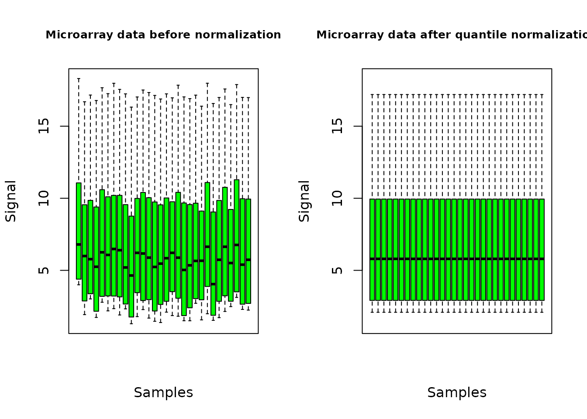

The plot of the output shows the distribution of the signal over all the
probes, for each sample, before and after the normalization of data.

###### An example with metabolomic data

**Neither normalization nor transformation** is provided in the function
continuousomicdata(). The **pre-treatment of metabolomic data must be
done before importation of data**, and **data must be imported in log
scale**, so that they can be directly modelled using a **Gaussian
(normal) error model**. This strong hypothesis is required both for
selection of items and for dose-reponse modeling (see the [section on
least squares](#leastsquares) for a reminder if needed). In the context
of a multi-omics approach we recommend the use of a log2 transformation,
instead of the classical log10 for such data, so as to facilitate the
comparison of results obtained with transcriptomics data generally
handled in a log2 scale.

For instance, a basic procedure for the pre-treatment of metabolomic
data could follow the three steps described thereafter: i) removing of
metabolites for which the proportion of missing data (non detected)
across all the samples is too high (more than 20 to 50 percents
according to your tolerance level); ii) retrieving of missing values
data using half minimum method (i.e. half of the minimum value found for
a metabolite across all samples); iii) log-transformation of values. If
a scaling to the total intensity (normalization by sum of signals in
each sample) or another normalization is necessary and pertinent, we
recommend to do it before those three previously described steps.

``` r
metabolofilename <- system.file("extdata", "metabolo_sample.txt", package = "DRomics")
# metabolofilename <- "yourchosenname.txt" # for a local file
```

``` r
(o.metabolo <- continuousomicdata(metabolofilename))
```

    ## Elements of the experimental design in order to check the coding of the data:
    ## Tested doses and number of replicates for each dose:
    ## 
    ##    0 0.69  1.1 1.79 2.92 4.78 7.76 
    ##   10    6    2    2    2    6    2 
    ## Number of items: 109 
    ## Identifiers of the first 20 items:
    ## 
    ##  [1] "P_2"  "P_4"  "P_5"  "P_6"  "P_7"  "P_10" "P_11" "P_12" "P_14" "P_16"
    ## [11] "P_19" "P_21" "P_22" "P_26" "P_32" "P_34" "P_35" "P_36" "P_37" "P_38"

``` r
plot(o.metabolo, col = "green")
```

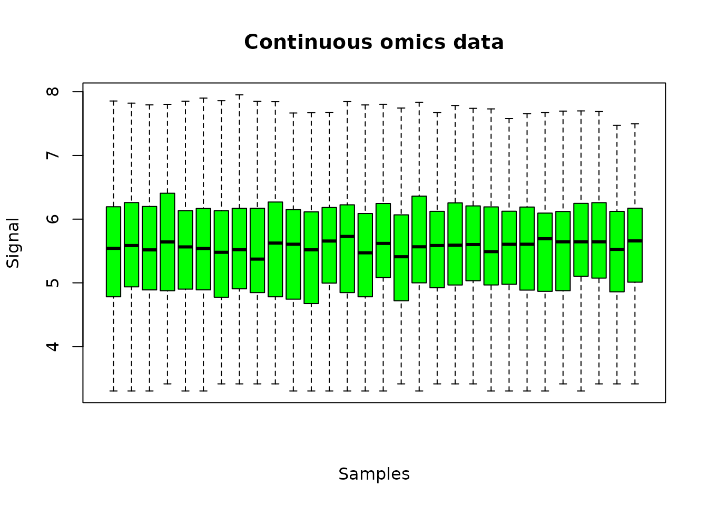

The plot of the output shows the distribution of the signal over all the
metabolites, for each sample.

The deprecated metabolomicdata() function was renamed
continuousomicdata() in the recent versions of the package (while
keeping the first name available) to **offer its use to other continuous
omic data** such as **proteomics data** (when expressed in intensity) or
**RT-qPCR data**. As for metabolomic data, the **pre-treatment** of
other continuous omic data must be done **before importation**, and
**data must be imported in a scale that enables the use of a Gaussian
error model** as this strong hypothesis is required both for selection
of items and for dose-response modeling.

###### An example with continuous anchoring apical data

No transformation is provided in the function continuousanchoringdata().
**If needed the pre-treatment of data must be done before importation of
data**, so that they can be directly modelled using a **Gaussian error
model**. This strong hypothesis is required both for selection of
responsive endpoints and for dose-reponse modeling (see the [section on
least squares](#leastsquares) for a reminder if needed).

``` r
anchoringfilename <- system.file("extdata", "apical_anchoring.txt", package = "DRomics")
# anchoringfilename <- "yourchosenname.txt" # for a local file
```

In the following example the argument backgrounddose is used to specify
that doses below or equal to 0.1 are considered as 0 in the DRomics
workflow. Specifying this argument is necessary when there is no dose at
0 in the data (see [section on *in situ* data](#insitudata) for details
on this point).

``` r
(o.anchoring <- continuousanchoringdata(anchoringfilename, backgrounddose = 0.1))
```

    ## Elements of the experimental design in order to check the coding of the data:
    ## Tested doses and number of replicates for each dose:
    ## 
    ##    0  2.4  3.8  6.2 10.1 16.5 26.8 43.5 70.7 
    ##   12    6    2    2    2    6    2    2    2 
    ## Number of endpoints: 2 
    ## Names of the endpoints:
    ## [1] "growth"         "photosynthesis"

``` r
plot(o.anchoring) + theme_bw()
```

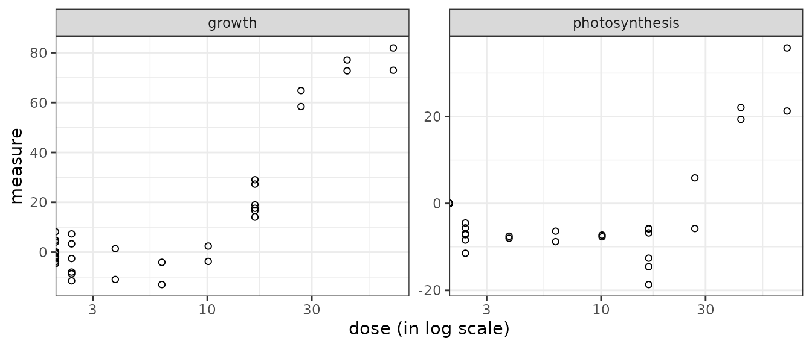

For such data the plot() function simply provides a dose-response plot
for each endpoint. By default the dose is represented on a log scale, it
is why responses for the control (null dose, so minus infinity in log
scale) appear as half points on the Y-axis. It can be changed using the
argument dose_log_transfo as below.

``` r
plot(o.anchoring, dose_log_transfo = FALSE) + theme_bw()
```

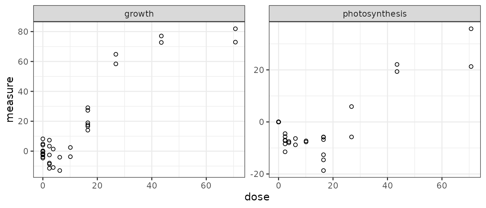

##### Handling of data collected through specific designs

The DRomics workflow was first developed for data collected through a
typical dose-response experiment, with a reasonable number of tested
doses (or concentrations - at least 4 in addition to the control and
ideally 6 to 8) and a small number of replicates per dose. Recently we
made some modifications in the package to **make possible the use of
designs with only 3 doses in addition to the control even if this type
of design is not recommended for dose-response modeling**.

**We also extended our workflow to handle *in situ* (observational)
data**, for which there is **no replication, as the dose (or
concentration) is not controlled** (see [an example with in situ
data](#insitudata) for more details).

It is also now possible to handle **experimental data collected using a
design with a batch effect** using DRomics together with functions from
the Bioconductor package
[sva](https://bioconductor.org/packages/release/bioc/html/sva.html) to
correct for this batch effect before selection and modeling steps. We
also developed the **PCAplot() function to help visualizing this batch
effect** and the impact of the **batch effect correction (BEC)** on data
(see [an example with RNAseq data from an experiment with a batch
effect](#batcheffect) for more details on how to handle such a case and
see ?PCAplot for details on this specific function **that could also be
used to identify potential outlier samples**).

###### An example with *in situ* (observational) RNAseq data

One of the problem that may occur in particular with *in situ* data, is
the absence of real control samples, corresponding to a strictly null
exposure dose or concentration. **To prevent an hazardous calculation of
the BMD (see [Step 4](#step4) for definition of BMD) by extrapolation in
such a case, one should use the argument backgrounddose to define the
maximal measured dose that can be considered as a negligible dose.** All
doses below or equal to the value given in backgrounddose will be fixed
at 0, so as to be considered at the **background level of exposition**.

For *in situ* data (and more generally for data with a very large number
of samples), the **use of the rlog transformation in RNAseqdata() is not
recommended**, both for speed reason and because you are **more likely
to encounter a problem with the rlog transformation in case of
outliers** in such a case (see
<https://support.bioconductor.org/p/105334/> for an explanation of the
author of
[DESeq2](https://bioconductor.org/packages/release/bioc/html/DESeq2.html)
and if you want to see an example of problems that may appear with
outliers in that case, just force the `transfo.method` to `"rlog"` in
the following example).

``` r
datafilename <- system.file("extdata", "insitu_RNAseq_sample.txt", package="DRomics")
# Importation of data specifying that observed doses below the background dose
# fixed here to 2e-2 will be considered as null dose to have a control 
(o.insitu <- RNAseqdata(datafilename, backgrounddose = 2e-2, transfo.method = "vst"))
```

    ## Elements of the experimental design in order to check the coding of the data:
    ## Tested doses and number of replicates for each dose:
    ## 
    ##       0  0.0205  0.0216  0.0248  0.0272  0.0322  0.0339  0.0387  0.0432  0.0463 
    ##      25       1       1       1       1       1       1       1       1       1 
    ## 0.04866  0.0528  0.0726   0.101   0.112  0.1122   0.167   2.089   2.474   2.892 
    ##       1       1       3       1       1       1       1       1       1       1 
    ##   2.899   2.904   3.008    3.16   3.199   3.251   3.323   3.483   3.604   4.484 
    ##       1       1       1       1       1       1       1       1       1       1 
    ##   4.917   4.924   5.509    8.53    9.16    9.38     9.5    9.83   10.35   11.06 
    ##       1       1       1       1       1       1       1       1       1       1 
    ##   11.34   11.94   12.11   12.39   13.51    14.8   16.26   16.89    18.2   18.28 
    ##       1       1       1       1       1       1       1       1       1       1 
    ##   19.14   20.62    20.7   21.13 23.0348   23.69   24.15   27.06   28.05   29.88 
    ##       1       1       1       1       1       1       1       1       1       1 
    ##   36.28 
    ##       1 
    ## Number of items: 1000 
    ## Identifiers of the first 20 items:
    ##  [1] "N00000000001_c0_g1" "N00000000002_c0_g1" "N00000000003_c0_g1"
    ##  [4] "N00000000004_c0_g1" "N00000000005_c0_g1" "N00000000006_c0_g1"
    ##  [7] "N00000000008_c0_g1" "N10000_c0_g1"       "N10000_c0_g1.1"    
    ## [10] "N10001_c0_g1"       "N10008_c1_g1"       "N10010_c0_g1"      
    ## [13] "N10010_c1_g1"       "N10011_c0_g1"       "N10012_c0_g1"      
    ## [16] "N100156_c0_g1"      "N1001_c0_g1"        "N10021_c0_g1"      
    ## [19] "N10021_c0_g1.1"     "N10021_c0_g1.2"    
    ## Data were normalized with respect to library size and tranformed using 
    ## the following method: vst

``` r
plot(o.insitu)
```


The plot of the output shows the distribution of the signal on all the
contigs, for each sample (here the box plots are stuck to each other due
to the large number of samples), before and after the normalization and
transformation of data.

###### An example with RNAseq data from an experiment with a batch effect

When omics data are collected through a **design with a known potential
batch effect**, the **DRomics function PCAplot()** can be used as in the
example below to **visualize the impact of this batch effect on the
data**. If it seems necessary, **functions from specific packages** can
then be used to perform **batch effect correction (BEC)**. We recommend
the use of functions **ComBat()** and **ComBat_seq()** from the
Bioconductor
**[sva](https://bioconductor.org/packages/release/bioc/html/sva.html)**
package for this purpose, respectively for **microarray** (or other
continuous omic data) and **RNAseq data**.

As
**[sva](https://bioconductor.org/packages/release/bioc/html/sva.html)**
is a Bioconductor package, it must be installed in the same way as
**[DESeq2](https://bioconductor.org/packages/release/bioc/html/DESeq2.html)**
and
**[limma](https://www.bioconductor.org/packages/release/bioc/html/limma.html)**
previously to be loaded. If needed look at the DRomics web page to get
the good instruction to install Bioconductor packages:
<https://lbbe.univ-lyon1.fr/fr/dromics>).

Below is an example using ComBat-seq() on RNAseq data with batch effect.
As the sva package does not import the RNAseq data in the same format as
DRomics, it is necessary to use the DRomics function
formatdata4DRomics() to interoperate between ComBat-seq in DRomics
functions (see the [section on importation as an R object](#Robject) for
details on this function or ?formatdata4DRomics).

``` r
# Load of data
data(zebraf)
str(zebraf)
```

    ## List of 3
    ##  $ counts: int [1:1000, 1:16] 453 331 897 12 326 533 1948 904 583 154 ...
    ##   ..- attr(*, "dimnames")=List of 2
    ##   .. ..$ : chr [1:1000] "ENSDARG00000102141" "ENSDARG00000102123" "ENSDARG00000114503" "ENSDARG00000115971" ...
    ##   .. ..$ : chr [1:16] "I10_05mG_E5" "I10_05mG_E6" "I10_05mG_E7" "I10_C5" ...
    ##  $ dose  : num [1:16] 500 500 500 0 0 0 0 50000 50000 50000 ...
    ##  $ batch : Factor w/ 2 levels "I10","I17": 1 1 1 1 1 1 1 2 2 2 ...

``` r
# Look at the design of this dataset
xtabs(~ zebraf$dose + zebraf$batch)
```

    ##            zebraf$batch
    ## zebraf$dose I10 I17
    ##       0       4   3
    ##       500     3   0
    ##       5000    0   3
    ##       50000   0   3

It appears in this design that the data were obtained using to batches,
with only the controlled condition (null dose) appearing in both
batches.

``` r
# Formating of data using the formatdata4DRomics() function
data4DRomics <- formatdata4DRomics(signalmatrix = zebraf$counts, 
                           dose = zebraf$dose)

# Importation of data just to use DRomics functions
# As only raw data will be given to ComBat_seq after
(o <- RNAseqdata(data4DRomics))
```

    ## Just wait, the transformation using regularized logarithm (rlog) may 
    ## take a few minutes.

    ## Elements of the experimental design in order to check the coding of the data:
    ## Tested doses and number of replicates for each dose:
    ## 
    ##     0   500  5000 50000 
    ##     7     3     3     3 
    ## Number of items: 1000 
    ## Identifiers of the first 20 items:
    ##  [1] "ENSDARG00000102141" "ENSDARG00000102123" "ENSDARG00000114503"
    ##  [4] "ENSDARG00000115971" "ENSDARG00000098311" "ENSDARG00000104839"
    ##  [7] "ENSDARG00000100143" "ENSDARG00000102474" "ENSDARG00000104049"
    ## [10] "ENSDARG00000102226" "ENSDARG00000103095" "ENSDARG00000102128"
    ## [13] "ENSDARG00000110470" "ENSDARG00000100422" "ENSDARG00000104632"
    ## [16] "ENSDARG00000100660" "ENSDARG00000113107" "ENSDARG00000099787"
    ## [19] "ENSDARG00000112451" "ENSDARG00000070546"
    ## Data were normalized with respect to library size and tranformed using 
    ## the following method: rlog

``` r
# PCA plot with the sample labels
PCAdataplot(o, label = TRUE) + theme_bw()
```

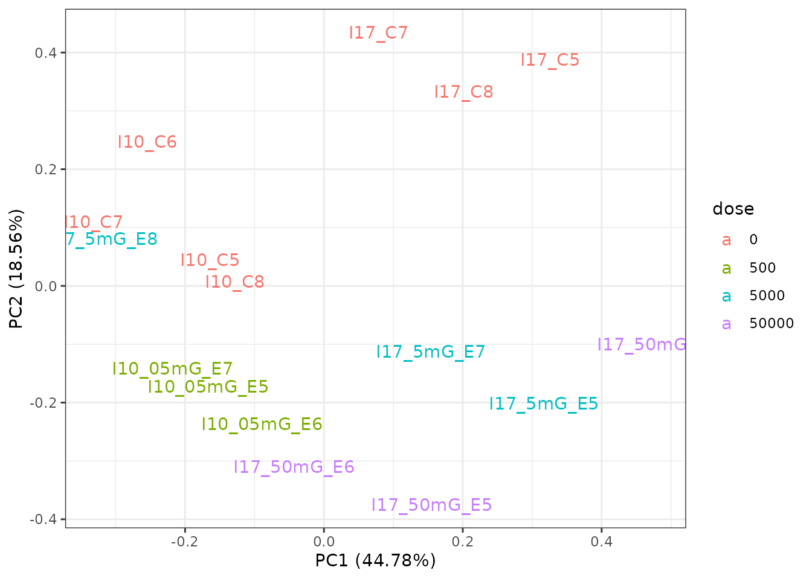

``` r
# PCA plot to visualize the batch effect
PCAdataplot(o, batch = zebraf$batch) + theme_bw()
```

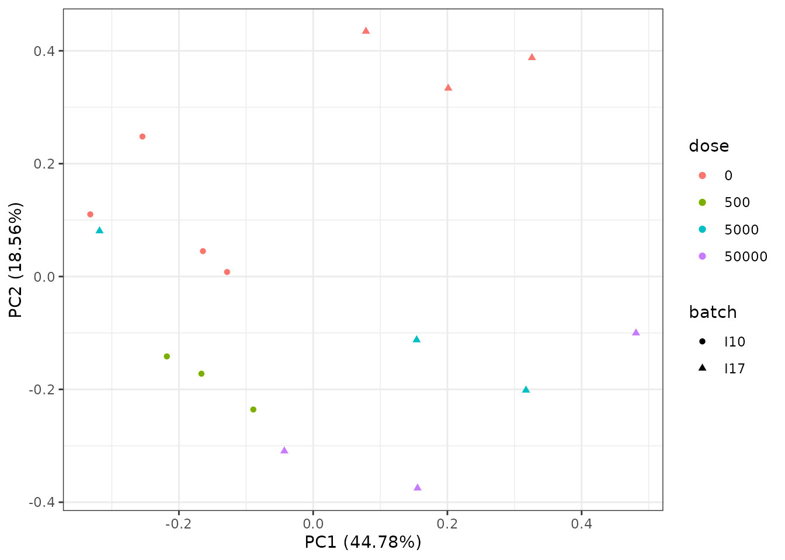

The PCA plot shows an impact of the batch effect, that clearly appears
on controls (red points) which were obtained on two different batches.

``` r
# Batch effect correction using ComBat_seq{sva}
require(sva)
BECcounts <- ComBat_seq(as.matrix(o$raw.counts), 
                        batch = as.factor(zebraf$batch), 
                        group = as.factor(o$dose)) 
```

``` r
# Formating of data after batch effect correction
BECdata4DRomics <- formatdata4DRomics(signalmatrix = BECcounts, 
                                   dose = o$dose)
o.BEC <- RNAseqdata(BECdata4DRomics)
```

    ## Just wait, the transformation using regularized logarithm (rlog) may 
    ## take a few minutes.

``` r
# PCA plot after batch effect correction
PCAdataplot(o.BEC, batch = zebraf$batch) + theme_bw()
```

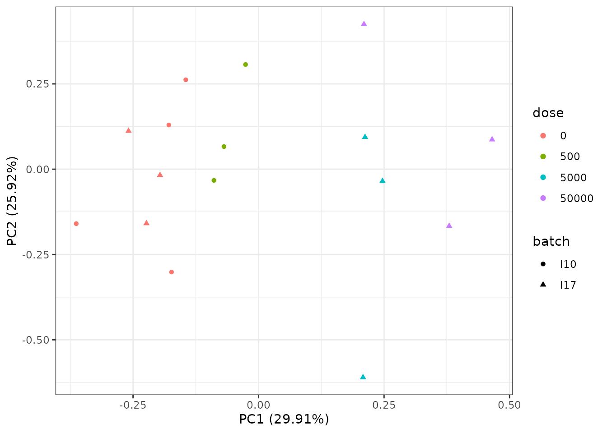

The PCA plot after BEC shows the impact of the correction on the batch
effect that is no more visible on controls (red points).

### Step 2: selection of significantly responding items

For the second step of the workflow, the function **itemselect()** must
be used simply **taking as input in a first argument the output of the
function used in [step 1](#step1)** (output of RNAseqdata(),
microarraydata(), continuousomicdata() or continuousanchoringdata()).
Below is an example with microarray data.

``` r
(s_quad <- itemselect(o.microarray, select.method = "quadratic", FDR = 0.01))
```

    ## Number of selected items using a quadratic trend test with an FDR of 0.01: 150
    ## Identifiers of the first 20 most responsive items:
    ##  [1] "383.2" "384.2" "363.1" "383.1" "384.1" "363.2" "364.2" "364.1" "300.2"
    ## [10] "301.1" "300.1" "301.2" "263.2" "27.2"  "25.1"  "368.1" "351.1" "15"   
    ## [19] "370"   "350.2"

The **false discovery rate (FDR) corresponds to the expected proportion
of items that will be falsely detected as responsive**. **With a very
large data set** it is important to define a selection step based on an
FDR not only **to reduce the number of items to be further processed**,
but also **to remove too noisy dose-response signals that may impair the
quality of the results**. We recommend to set a value between 0.001 and
0.1 depending of the initial number of items. When this number is very
high (more than several tens of thousands), we recommend a FDR less than
0.05 (0.001 to 0.01) to increase the robustness of the results ([Larras
et al. 2018](https://hal.science/hal-02309919/document)).

Concerning the method used for selection, **we recommend the default
choice (“quadratic”) for a typical omics dose-response design (many
doses/concentrations with few replicates per condition)**. It enables
the **selection of both monotonic and biphasic dose-response
relationships**. If you want to focus on monotonic dose-response
relationships, the “linear” method could be chosen. For a design with a
small number of doses/concentrations and many replicates (not optimal
for dose-response modeling), the “ANOVA” method could be preferable.
**For *in situ* data** (observational data without replicates due to
uncontrolled dose), **only trend tests will be proposed** as the use of
an ANOVA test in absence of replicates for some conditions is not
reasonable.

Each of the three methods proposed for this selection step is based on
the use of a simple model (quadratic,linear or ANOVA-type) linking the
signal to the dose in a rank scale. This model is internally fitted to
data by an **empirical Bayesian approach** using the respective packages
**[DESeq2](https://bioconductor.org/packages/release/bioc/html/DESeq2.html)**
and
**[limma](https://www.bioconductor.org/packages/release/bioc/html/limma.html)**
for **RNAseq data** and **microarray or continuous omics data**, and by
classical **linear regression** using the lm() function for **continuous
anchoring data**. The adjustment of p-values according to the specified
FDR is performed in any case, even for continuous anchoring data, so as
to ensure the unicity of the workflow independently of the type of data.

See ?itemselect for more details and [Larras et
al. 2018](https://hal.science/hal-02309919/document) comparison of the
three proposed methods on an example.

It is easy, using for example the package **VennDiagram**, to compare
the selection of items obtained using two different methods, as in the
following example.

``` r
require(VennDiagram)
s_lin <- itemselect(o.microarray, select.method = "linear", FDR = 0.01)
index_quad <- s_quad$selectindex
index_lin <- s_lin$selectindex
plot(c(0,0), c(1,1), type = "n", xaxt = "n", yaxt = "n", bty = "n", xlab = "", ylab = "")
draw.pairwise.venn(area1 = length(index_quad), area2 = length(index_lin), 
                   cross.area = length(which(index_quad %in% index_lin)), 
                   category = c("quadratic trend test", "linear trend test"),
                   cat.col=c("cyan3", "darkorange1"), col=c("black", "black"), 
                   fill = c("cyan3", "darkorange1"), lty = "blank", cat.pos = c(1,11))
```

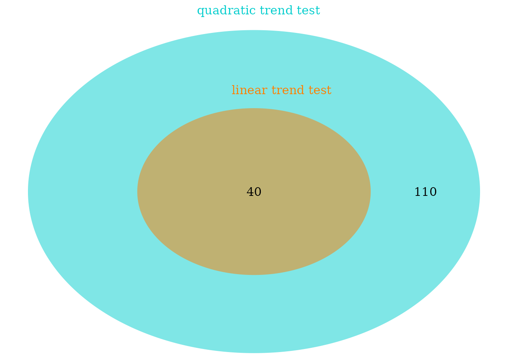

### Step 3: fit of dose-response models, choice of the best fit for each curve

#### Fit of the best model

For Step 3 the function drcfit() simply **takes as input in a first
argument the output of itemselect()**. For each item selected in Step 2,
the model that best fits the dose-response data is chosen among a
**family of five simple models built to describe a wide variety of
monotonic and biphasic dose-response curves (DRC)** (and exclusively
monotonic and biphasic curves : it is why more flexible models such as
polynomial third and fourth order classical polynomial models were
deliberately not considered). For a complete description of those models
see the [last section of Step 3](#models) or [Larras et
al. 2018](https://hal.science/hal-02309919/document).

The procedure used to **select the best fit** is based on an
**information criterion** as described in [Larras et
al. 2018](https://hal.science/hal-02309919/document) and in ?drcfit. The
**classical** and **former default option** of the **AIC** (Akaike
criterion - default information criterion used in DRomics versions \<
2.2-0) was **replaced by the default use of the AICc** (second-order
Akaike criterion) in order to **prevent the overfitting** that may occur
with dose-response designs with a small number of data points, as
recommended and now classically done in regression ([Hurvich and Tsai,
1989](https://www.stat.berkeley.edu/~binyu/summer08/Hurvich.AICc.pdf);
Burnham and Anderson DR, 2004).

As the call to the drcfit() function may take time when the number of
pre-selected items is large, by default a progressbar is provided. Some
arguments of this function can be used to specify **parallel computing
to accelerate the computation** (see ?drcfit for details).

``` r
(f <- drcfit(s_quad, progressbar = FALSE))
```

    ## Results of the fitting using the AICc to select the best fit model
    ## 24 dose-response curves out of 150 previously selected were removed 
    ## because no model could be fitted reliably.
    ## Distribution of the chosen models among the 126 fitted dose-response curves:
    ## 
    ##             Hill           linear      exponential     Gauss-probit 
    ##                1               30               38               47 
    ## log-Gauss-probit 
    ##               10 
    ## Distribution of the trends (curve shapes) among the 126 fitted dose-response curves:
    ## 
    ## bell  dec  inc    U 
    ##   37   37   33   19

In the following you can see the first lines of the output data frame on
our example (see ?drcfit for a complete description of the columns of
the output data frame.) This output data frame provides information for
each item, such as **the best-fit model**, **its parameter values**, the
**standard residual error (SDres)** (see the section on [least
squares](#leastsquares) for his definition), **coordinates of particular
points**, and the **trend of the curve** (among increasing, decreasing,
U-shaped, bell-shaped).

An extensive description of the outputs of the complete DRomics workflow
is provided in the [last section of the main workflow](#outputs). Note
that the number of items successfully fitted (output of Step 3) is often
smaller that the number of items selected in Step 2, as for some of the
selected items, all models may fail to converge or fail to significantly
better describe the data than the constant model.

``` r
head(f$fitres)
```

    ##      id irow adjpvalue        model nbpar       b    c     d    e    f SDres
    ## 1 383.2  725  2.08e-07 Gauss-probit     4  5.5836 8.58  8.58 1.70 3.62 0.157
    ## 2 384.2  727  2.08e-07  exponential     3 -0.0298   NA 12.24 1.76   NA 0.160
    ## 3 363.1  686  2.24e-07  exponential     3 -0.2058   NA  9.10 3.11   NA 0.218
    ## 4 383.1  724  2.24e-07 Gauss-probit     4  5.4879 8.75  8.75 1.72 3.58 0.169
    ## 5 384.1  726  3.41e-07 Gauss-probit     4  6.8453 7.26  7.26 1.77 5.01 0.158
    ## 6 363.2  687  7.01e-07  exponential     3 -0.1467   NA  9.10 2.77   NA 0.206
    ##        typology trend   y0 yatdosemax yrange maxychange xextrem yextrem
    ## 1       GP.bell  bell 12.0      11.03   1.17      1.004    1.70    12.2
    ## 2 E.dec.concave   dec 12.2      10.99   1.25      1.251      NA      NA
    ## 3 E.dec.concave   dec  9.1       7.58   1.53      1.527      NA      NA
    ## 4       GP.bell  bell 12.2      11.15   1.18      1.012    1.72    12.3
    ## 5       GP.bell  bell 12.1      11.15   1.11      0.949    1.77    12.3
    ## 6 E.dec.concave   dec  9.1       7.64   1.46      1.461      NA      NA

#### Plot of fitted curves

By default the plot() function used on the output of the drcfit()
function provides the first 20 fitted curves (or the ones you specify
using the argument items) with observed points. **Fitted curves are
represented in red, replicates are represented in open circles and means
of replicates at each dose/concentration are represented by solid
circles**. All the fitted curves may be saved in a pdf file using the
plotfit2pdf() function (see ?drcfit).

``` r
plot(f) 
```

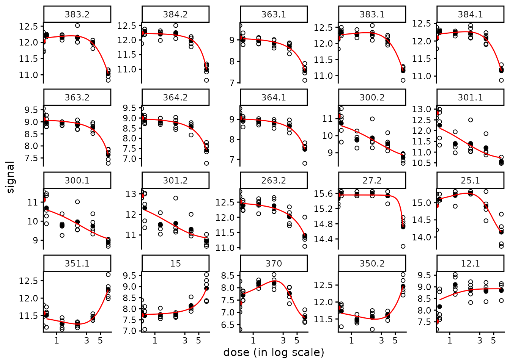

The fitted curves are by default **represented using a log scale** for
dose/concentration, which is more suited in common cases where the range
of observed doses/concentrations is very wide and/or where tested
doses/concentrations are obtained by dilutions. It is why the
observations at the control appear differently as the other
observations, as half circles on the y-axis, to remind that their true
value is minus infinity in a log scale. Use `dose_log_transfo = FALSE`
to keep the raw scale of doses (see below).

Another **specific plot function named targetplot() can be used to plot
targeted items, whether they were or not selected** in step 2 and fitted
in step 3. See an example below and details in ?targetplot. In this
example, the default arbitrary space between the y-axis (so the points
at control) and the points at the first non null doses was enlarged by
fixing the limits of the x-axis as below :

``` r
targetitems <- c("88.1", "1", "3", "15")
targetplot(targetitems, f = f) + scale_x_log10(limits = c(0.2, 10))
```

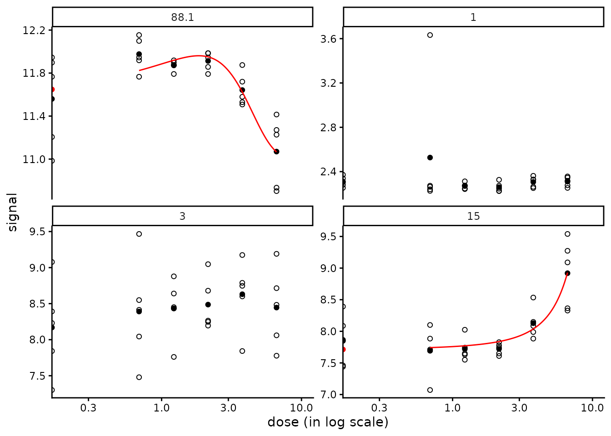

#### Plot of residuals

**To check the assumption of the Gaussian error model** (see the
[section on least squares](#leastsquares)), two types of residual plots
can be used, `"dose_residuals"` for plot of residuals against the
observed doses/concentrations, or `"fitted_residuals"` for plot of
residuals against fitted values of the modeled signal. The residual
plots for all items may also be saved in a pdf file using the
plotfit2pdf() function (see ?drcfit).

``` r
plot(f, plot.type = "dose_residuals")
```

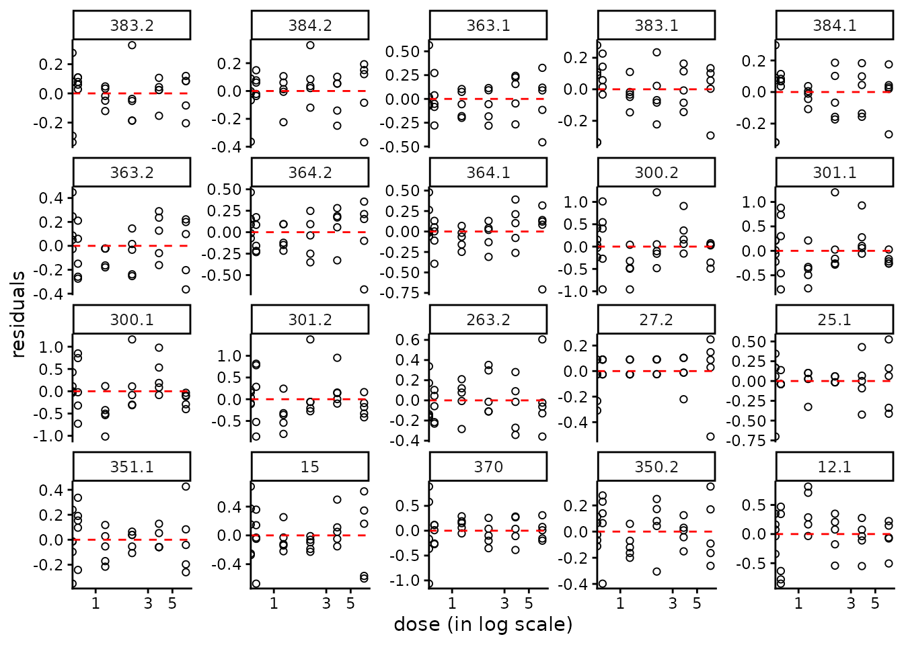

#### Description of the family of dose-response models fitted in DRomics

The best fit model is chosen among the five following models describing
the observed signal $y$ as a function of $x$ the dose (or
concentration):

- the **linear model**: $$y = d + b \times x$$ with **2 parameters**,
  $b$ the slope and $d$ the mean signal at control.
- the **exponential model**:
  $$y = d + b \times \left( exp\left( \frac{x}{e} \right) - 1 \right)$$
  with **3 parameters**,  
  $b$ a shape parameter, $d$ the mean signal at control, $e$ a shape
  parameter.
  - When $e > 0$ the dose response curve - DRC - is increasing if
    $b > 0$ and decreasing if $b < 0$, with no asymptote for high doses.
  - When $e < 0$ the DRC is increasing if $b < 0$ and decreasing if
    $b > 0$, with an asymptote at $d - b$ for high doses.
- the **Hill model**:
  $$y = c + \frac{d - c}{1 + \left( \frac{x}{e} \right)^{b}}$$ with **4
  parameters**,  
  $b$ ($> 0$) a shape parameter, $c$ the asymtotic signal for high
  doses, $d$ the mean signal at control, and $e$ ($> 0$) the dose at the
  inflection point of the sigmoid.
- the **Gauss-probit model** built as the sum of a Gauss and a probit
  part sharing the same parameters as defined
  below:$$y = f \times exp\left( - 0.5\left( \frac{x - e}{b} \right)^{2} \right) + d + (c - d) \times \Phi\left( \frac{x - e}{b} \right)$$
  with **5 parameters**,  
  $b$ ($> 0$) a shape parameter corresponding to the standard deviation
  of the Gauss part of the model, $c$ the asymtotic signal for high
  doses, $d$ the asymptotic signal on the left of the DRC (generally
  corresponding to a fictive negative dose), $e$ ($> 0$) a shape
  parameter corresponding to the mean of the Gauss part of the model,
  and $f$ the amplitude and sign of the Gauss part of the model (the
  model is U-shaped if $f < 0$ and bell-shaped if $f < 0$).  
  $\Phi$ represents the cumulative distribution function (CDF) of the
  standard Gauss (also named normal or Gaussian) distribution.  
  This model encompasses **two simplifed versions with 4 parameters**,
  one **monotonic** (for $f = 0$) and one with **symmetrical
  asymptotes** (for $c = d$).
- the **log-Gauss-probit model**, a variant of the previous one with on
  the log scale of the dose:
  $$y = f \times exp\left( - 0.5\left( \frac{ln(x) - ln(e)}{b} \right)^{2} \right) + d + (c - d) \times \Phi\left( \frac{ln(x) - ln(e)}{b} \right)$$  
  with **5 parameters**,  
  $b$ ($> 0$) a shape parameter corresponding to the standard deviation
  of the Gauss part of the model, $c$ the asymtotic signal for high
  dose, $d$ the asymptotic signal on the left of the DRC, reached at the
  control (for $ln(x) = ln(0) = - \infty$), $ln(e)$ ($> 0$) a shape
  parameter corresponding to the mean of the Gauss part of the model,
  and $f$ the amplitude and sign of the Gauss part of the model (the
  model is U-shaped if $f < 0$ and bell-shaped if $f < 0$).  
  $\Phi$ represents the cumulative distribution function (CDF) of the
  standard Gauss distribution.  
  As the previous one, this model encompasses **two simplifed versions
  with 4 parameters**, one **monotonic** (for $f = 0$) and one with
  **symmetrical asymptotes** (for $c = d$).

This family of five models was built to be able to describe a wide range
of monotonic and biphasic DRC. In the following plot were represented
typologies of curves that can be described using those models, depending
of the definition of their parameters. In the following plot the curves
are represented with the signal in y-axis and the raw dose in x-axis.
**As the range of tested or observed doses is often large**, we decided
to plot model fits **by default using a log scale of doses**. The
**shape of models will be transformed in this log x-scale**, and
**especially the linear model will no more appear as a straight line as
below**.

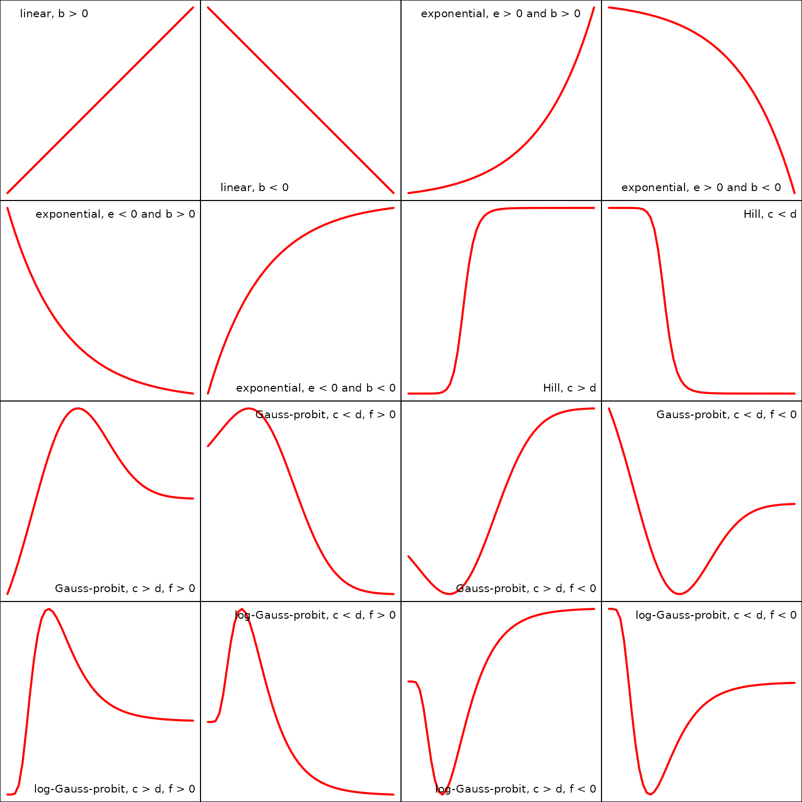

#### Reminder on least squares regression

It is important when using DRomics to have in mind that the
dose-response models are fitted using the **least squares regression**,
assuming an **additive Gaussian (normal) error model** for the observed
signal. It is why the scale under which you should import your data is
very important: a log (or pseudo-log) transformation may be necessary to
meet the use conditions of the model for some types of data.  
Let us recall the formulation of the Gaussian model defining the signal
(after transformation if needed) $y$ as a function of the dose (or
concentration) $x$, $f$ being one of the five models previously
described, and $\theta$ the vector of its parameters (of length 2 to 5).

$$y = f(x,\theta) + \epsilon$$ with
$$\epsilon \sim N(0,\sigma)$$$N(0,\sigma)$ representing the Gaussian
(normal) distribution of mean $0$ and standard deviation (SD) $\sigma$.

In this model, the **residual standard deviation $\sigma$ is assumed
constant**. It is the classical “homoscedasticity” hypothesis (see the
following figure for an illustration). The examination of residuals (see
the section on [plot of residuals](#residuals)) is a good way to check
that the error model is not strongly violated on your data.

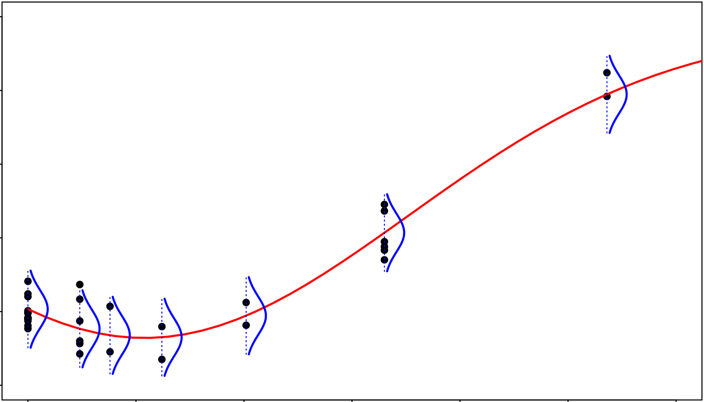

### Step 4: calculation of benchmark doses (BMD)

#### Calculation of BMD

The **two types of benchmark doses (BMD-zSD and BMD-xfold) proposed by
the [EFSA
(2017)](https://efsa.onlinelibrary.wiley.com/doi/full/10.2903/j.efsa.2017.4658)
are systematically calculated** for each fitted dose-response curve
using the function **bmdcalc()** with the output of the drcfit()
function as a first argument, **but we strongly recommend the use of the
first one (BMD-zSD)** for reasons explained in [Larras et
al. 2018](https://hal.science/hal-02309919/document) (see ?bmdcalc for
details on this function).

``` r
(r <- bmdcalc(f, z = 1, x = 10))
```

    ## 1 BMD-xfold values and 0 BMD-zSD values are not defined (coded NaN as 
    ## the BMR stands outside the range of response values defined by the model).
    ## 59 BMD-xfold values and 0 BMD-zSD values could not be calculated (coded 
    ## NA as the BMR stands within the range of response values defined by the 
    ## model but outside the range of tested doses).

For the **recommended BMD-zSD**,the argument $z$, by default at 1, is
used to define the **BMD-zSD** as the dose at which the response is
reaching the **BMR (benchmark response)** defined as
$$BMR = y_{0} \pm z \times SD$$ with $y_{0}$ the level at the control
given by the dose-response fitted model and $SD$ the residual standard
deviation of the dose-response fitted model (also named $\sigma$ in the
[previous mathematical definition of the Gaussian
model](#leastsquares)).

For the less recommended BMD-xfold, the argument $x$, by default at 10
(for 10%), is used to define the BMD-xfold as the dose at which the
response is reaching the BMR defined as
$BMR = y_{0} \pm \frac{x}{100} \times y_{0}$. So this second BMD version
does not take into account the residual standard deviation, and is
strongly dependent of the magnitude of $y_{0}$, which may be a problem
if the signal at the control is close to 0, which is not rare on omics
data that are classically handled on log scale.

In the following you can see the first lines of the output data frame of
the function bmdcalc() on our example. BMD values are coded `NA` when
the BMR stands within the range of response values defined by the model
but outside the range of tested doses, and `NaN` when the BMR stands
outside the range of response values defined by the model due to
asymptotes.  
Very low BMD values obtained by extrapolation between 0 and the smallest
non null tested dose, that correspond to very sensitive items (that we
do not want to exclude), are thresholded at minBMD, an argument by
default fixed at the smallest non null tested dose divided by 100, but
that can be fixed by the user as what he considers to be a negligible
dose.

An extensive description of the outputs of the complete DRomics workflow
is provided in the [last section of the main workflow](#outputs). You
can also see ?bmdcalc for a complete description of its arguments and of
the columns of its output data frame.

``` r
head(r$res)
```

    ##      id irow adjpvalue        model nbpar       b    c     d    e    f SDres
    ## 1 383.2  725  2.08e-07 Gauss-probit     4  5.5836 8.58  8.58 1.70 3.62 0.157
    ## 2 384.2  727  2.08e-07  exponential     3 -0.0298   NA 12.24 1.76   NA 0.160
    ## 3 363.1  686  2.24e-07  exponential     3 -0.2058   NA  9.10 3.11   NA 0.218
    ## 4 383.1  724  2.24e-07 Gauss-probit     4  5.4879 8.75  8.75 1.72 3.58 0.169
    ## 5 384.1  726  3.41e-07 Gauss-probit     4  6.8453 7.26  7.26 1.77 5.01 0.158
    ## 6 363.2  687  7.01e-07  exponential     3 -0.1467   NA  9.10 2.77   NA 0.206
    ##        typology trend   y0 yatdosemax yrange maxychange xextrem yextrem BMD.zSD
    ## 1       GP.bell  bell 12.0      11.03   1.17      1.004    1.70    12.2    1.33
    ## 2 E.dec.concave   dec 12.2      10.99   1.25      1.251      NA      NA    3.26
    ## 3 E.dec.concave   dec  9.1       7.58   1.53      1.527      NA      NA    2.25
    ## 4       GP.bell  bell 12.2      11.15   1.18      1.012    1.72    12.3    1.52
    ## 5       GP.bell  bell 12.1      11.15   1.11      0.949    1.77    12.3    1.41
    ## 6 E.dec.concave   dec  9.1       7.64   1.46      1.461      NA      NA    2.43
    ##   BMR.zSD BMD.xfold BMR.xfold
    ## 1   12.19        NA     10.83
    ## 2   12.08      6.59     11.02
    ## 3    8.89      5.26      8.19
    ## 4   12.33        NA     10.95
    ## 5   12.26        NA     10.89
    ## 6    8.90      5.47      8.19

#### Plots of the BMD distribution

The default plot of the output of the bmdcalc() function provides the
distribution of benchmark doses as an ECDF (Empirical Cumulative Density
Function) plot for the chosen BMD (“zSD”” or “xfold”). See an example
below.

``` r
plot(r, BMDtype = "zSD", plottype = "ecdf") + theme_bw() 
```

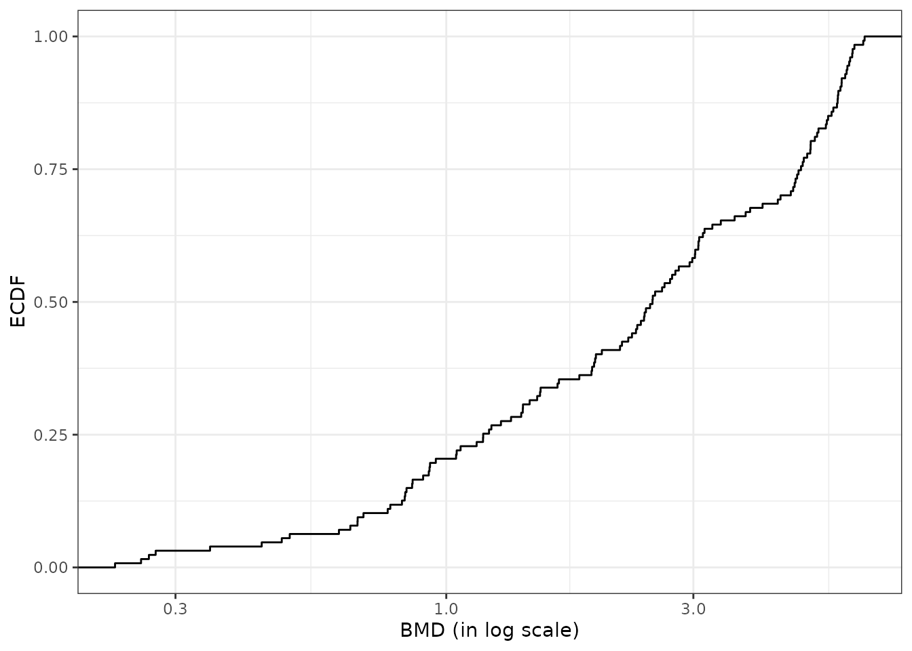

Different alternative plots are proposed (see ?bmdcalc for details) that
can be obtained using the argument plottype to choose the type of plot
(“ecdf”, “hist” or “density”) and the argument by to split the plot for
example by “trend”. You can also use the bmdplot() function to make an
ECDF plot of BMDs and personalize it (see ?bmdplot for details).

On a BMD ECDF plot one can add a **color gradient for each item** coding
for the **intensity of the signal** (after shift of the control signal
at 0) as a function of the dose (see ?bmdplotwithgradient for details
and an example below). It is generally necessary to use the argument
line.size to manually adjust the width of lines in that plot as the
default value does not always give a satisfactory resut. It is also
recommended (but not mandatory but it is the default option for the
argument `scaling`) to scale the signal in order to focus on the shape
of the dose-reponse curves and not on the amplitude of the signal
change.

``` r
bmdplotwithgradient(r$res, BMDtype = "zSD",
                    facetby = "trend", 
                    shapeby = "model",
                    line.size = 1.2,
                    scaling = TRUE) 
```

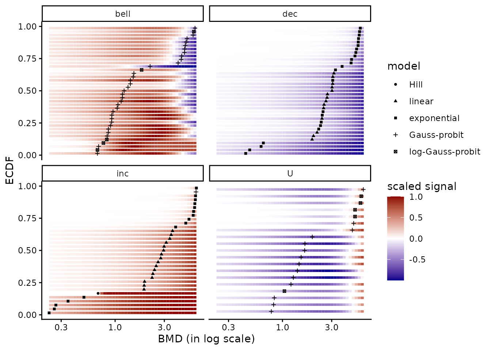

#### Calculation of confidence intervals on the BMDs by bootstrap

**Confidence intervals on BMD values** can be calculated by
**bootstrap**. As the call to this function may take much time, by
default a progressbar is provided and some arguments can be used to
specify parallel computing to accelerate the computation (see ?bmdboot
for details).

In the example below, a small number of iterations was used just to make
this vignette quick to compile, but **the default value of the argument
niter (1000) should be considered as a minimal value to obtain stable
results**.

``` r
(b <- bmdboot(r, niter = 50, progressbar = FALSE))
```

    ## Bootstrap confidence interval computation failed on 19 items among 126 
    ## due to lack of convergence of the model fit for a fraction of the 
    ## bootstrapped samples greater than 0.5.
    ## For 3 BMD.zSD values and 65 BMD.xfold values among 126 at least one 
    ## bound of the 95 percent confidence interval could not be computed due 
    ## to some bootstrapped BMD values not reachable due to model asymptotes 
    ## or reached outside the range of tested doses (bounds coded Inf)).

This function gives an output corresponding to the output of the
bmdcalc() function completed with bounds of BMD confidence intervals (by
default 95% confidence intervals) and the number of bootstrap iterations
for which the model was successfully fitted to the data. An extensive
description of the outputs of the complete DRomics workflow is provided
in the [last section of the main workflow](#outputs).

``` r
head(b$res)
```

    ##      id irow adjpvalue        model nbpar       b    c     d    e    f SDres
    ## 1 383.2  725  2.08e-07 Gauss-probit     4  5.5836 8.58  8.58 1.70 3.62 0.157
    ## 2 384.2  727  2.08e-07  exponential     3 -0.0298   NA 12.24 1.76   NA 0.160
    ## 3 363.1  686  2.24e-07  exponential     3 -0.2058   NA  9.10 3.11   NA 0.218
    ## 4 383.1  724  2.24e-07 Gauss-probit     4  5.4879 8.75  8.75 1.72 3.58 0.169
    ## 5 384.1  726  3.41e-07 Gauss-probit     4  6.8453 7.26  7.26 1.77 5.01 0.158
    ## 6 363.2  687  7.01e-07  exponential     3 -0.1467   NA  9.10 2.77   NA 0.206
    ##        typology trend   y0 yatdosemax yrange maxychange xextrem yextrem BMD.zSD
    ## 1       GP.bell  bell 12.0      11.03   1.17      1.004    1.70    12.2    1.33
    ## 2 E.dec.concave   dec 12.2      10.99   1.25      1.251      NA      NA    3.26
    ## 3 E.dec.concave   dec  9.1       7.58   1.53      1.527      NA      NA    2.25
    ## 4       GP.bell  bell 12.2      11.15   1.18      1.012    1.72    12.3    1.52
    ## 5       GP.bell  bell 12.1      11.15   1.11      0.949    1.77    12.3    1.41
    ## 6 E.dec.concave   dec  9.1       7.64   1.46      1.461      NA      NA    2.43
    ##   BMR.zSD BMD.xfold BMR.xfold BMD.zSD.lower BMD.zSD.upper BMD.xfold.lower
    ## 1   12.19        NA     10.83         0.489          3.93             Inf
    ## 2   12.08      6.59     11.02         1.724          4.58            6.40
    ## 3    8.89      5.26      8.19         1.366          3.52            4.61
    ## 4   12.33        NA     10.95         0.423          4.17             Inf
    ## 5   12.26        NA     10.89         0.481          4.36             Inf
    ## 6    8.90      5.47      8.19         1.334          3.31            4.75
    ##   BMD.xfold.upper nboot.successful
    ## 1             Inf               36
    ## 2             Inf               47
    ## 3            5.96               50
    ## 4             Inf               36
    ## 5             Inf               26
    ## 6            6.00               50

The plot() function applied on the output of the bmdboot() function
gives an ECDF plot of the chosen BMD with the confidence interval of
each BMD (see ?bmdcalc for examples). By default BMDs with an infinite
confidence interval bound are not plotted.

#### Filtering BMDs according to estimation quality

Using the bmdfilter() function, it is possible to use one of the three
filters proposed to retain only the items associated to the best
estimated BMD values.

- By default are retained only the items for which the BMD and its
  confidence interval are defined (using `"CIdefined"`) (so excluding
  items for which the bootstrap procedure failed).
- One can be even more restrictive by retaining items only if the BMD
  confidence interval is within the range of tested/observed doses
  (using `"CIfinite"`),
- or less restrictive (using `"BMDdefined"`) requiring that the BMD
  point estimate only must be defined within the range of
  tested/observed doses.

Let us recall that in the
[`bmdcalc()`](https://drgarden.pages.in2p3.fr/DRomics/reference/bmdcalc.md)
output, if it is not the case the BMD is coded `NA` or `NaN`.

Below is an example of application of the different filters based on
BMD-xfold values, chosen just to better illustrate the way filters work,
as there far more bad BMD-xfold estimations than bad BMD-zSD
estimations.

``` r
# Plot of BMDs with no filtering
subres <- bmdfilter(b$res, BMDfilter = "none")
bmdplot(subres, BMDtype = "xfold", point.size = 2, point.alpha = 0.4, 
        add.CI = TRUE, line.size = 0.4) + theme_bw()
```

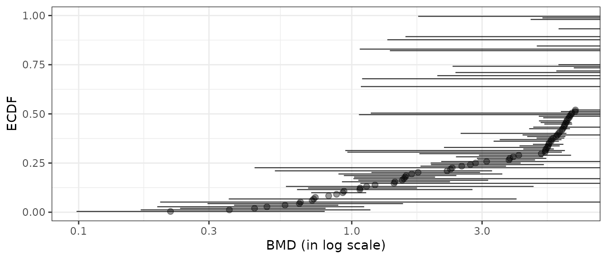

``` r
# Plot of items with defined BMD point estimate
subres <- bmdfilter(b$res, BMDtype = "xfold", BMDfilter = "definedBMD")
bmdplot(subres, BMDtype = "xfold", point.size = 2, point.alpha = 0.4, 
        add.CI = TRUE, line.size = 0.4) + theme_bw()
```

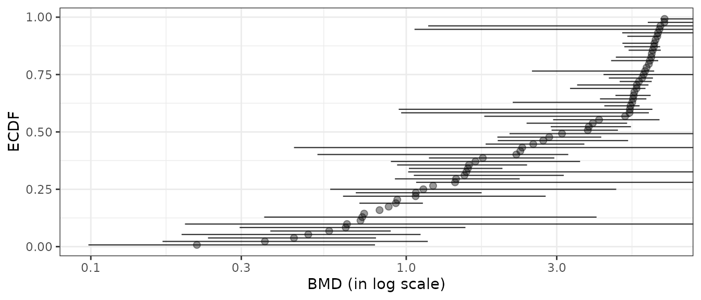

``` r
# Plot of items with defined BMD point estimate and CI bounds
subres <- bmdfilter(b$res, BMDtype = "xfold", BMDfilter = "definedCI")
bmdplot(subres, BMDtype = "xfold", point.size = 2, point.alpha = 0.4, 
        add.CI = TRUE, line.size = 0.4) + theme_bw()
```

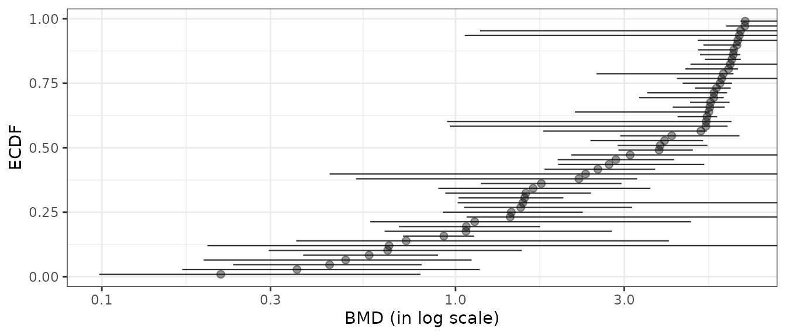

``` r
# Plot of items with finite BMD point estimate and CI bounds
subres <- bmdfilter(b$res, BMDtype = "xfold", BMDfilter = "finiteCI") 
bmdplot(subres, BMDtype = "xfold", point.size = 2, point.alpha = 0.4, 
        add.CI = TRUE, line.size = 0.4) + theme_bw()
```

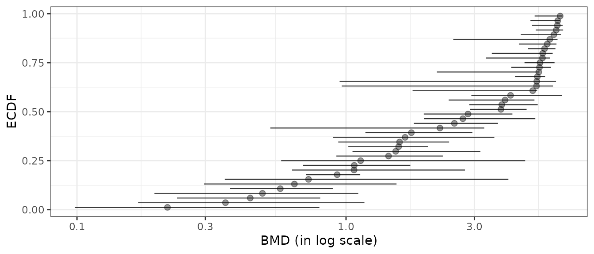

#### Plot of fitted curves with BMD values and confidence intervals

It is possible to add the output of bmdcalc() (or of bmdboot()) in the
argument BMDoutput of the plot() function of drcfit(), in order to add
BMD values (when defined) as a **vertical line on each fitted curve**,
and **bounds of the confidence intervals** (when successfully
calculated) as **two dashed lines**. **Horizontal dotted lines
corresponding to the two BMR potential values will be also added**. See
an example below.

``` r
# If you do not want to add the confidence intervals just replace b
# the output of bmdboot() by r the output of bmdcalc()
plot(f, BMDoutput = b) 
```

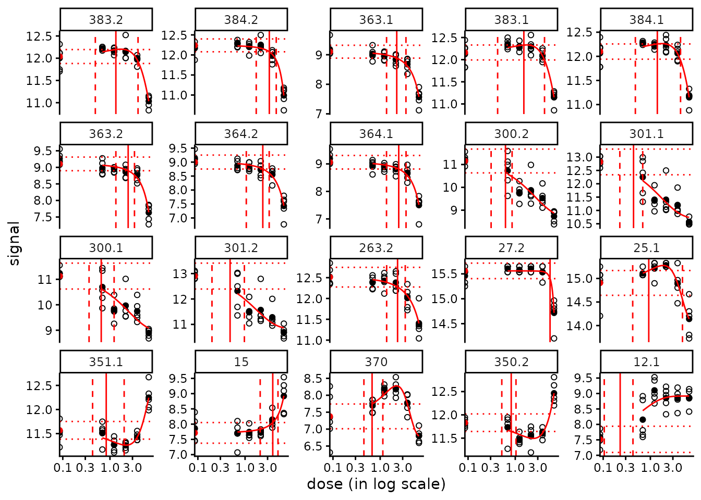

All the fitted curves may also be saved in the same way in a pdf file
using the plotfit2pdf() function (see ?drcfit).

#### Plot of all the fitted curves in one figure with points at BMD-BMR values

It is possible to use the curvesplot() function to plot all the fitted
curves in one figure and to add The use of the curvesplot() function is
more extensively described in the next parts and in the corresponding
help page. By default in this plot the curves are scaled to focus on the
shape of the dose-response and not on their amplitude (add
`scaling = FALSE` to see the curves without scaling) and a log dose
scale is used.

In the following plot we also added vertical lines corresponding to
tested doses on the plot and add transparency to visualize the density
of curves when shapes are similar (especially the case for linear
shapes).

``` r
tested.doses <- unique(f$omicdata$dose)
g <- curvesplot(r$res, xmax = max(tested.doses), colorby = "trend",
           line.size = 0.8, line.alpha = 0.3, point.size = 2, point.alpha = 0.6) +
  geom_vline(xintercept = tested.doses, linetype = 2) + theme_bw()
print(g)
```

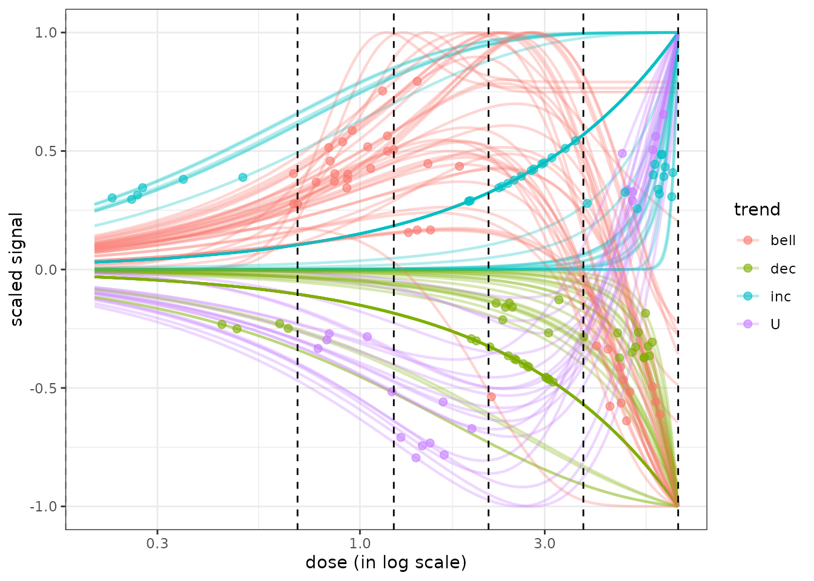

The use of the package plotly to make such a plot interactive can be
interesting for example to get the identifiant of each curve or to
choose what group of curves to eliminate or to focus on. You can try the
following code to get an interactive version of the previous figure.

``` r
if (require(plotly))
{
  ggplotly(g)
}
```

#### Description of the outputs of the complete DRomics workflow

The **output of the complete DRomics workflow**, given in `b$res` with
`b` being the output of bmdboot(), or the output of `bmdfilter(b$res)`
(see [previous section](#bmdfilter) for description of BMD filtering
options) is a **data frame** reporting the **results of the fit and BMD
computation on each selected item** sorted in the ascending order of the
adjusted p-values returned by the item selection step.

``` r
str(b$res)
```

    ## 'data.frame':    126 obs. of  28 variables:
    ##  $ id              : chr  "383.2" "384.2" "363.1" "383.1" ...
    ##  $ irow            : int  725 727 686 724 726 687 689 688 568 569 ...
    ##  $ adjpvalue       : num  2.08e-07 2.08e-07 2.24e-07 2.24e-07 3.41e-07 ...
    ##  $ model           : Factor w/ 5 levels "Hill","linear",..: 4 3 3 4 4 3 3 3 3 3 ...
    ##  $ nbpar           : num  4 3 3 4 4 3 3 3 3 3 ...
    ##  $ b               : num  5.5836 -0.0298 -0.2058 5.4879 6.8453 ...
    ##  $ c               : num  8.58 NA NA 8.75 7.26 ...
    ##  $ d               : num  8.58 12.24 9.1 8.75 7.26 ...
    ##  $ e               : num  1.7 1.76 3.11 1.72 1.77 ...
    ##  $ f               : num  3.62 NA NA 3.58 5.01 ...
    ##  $ SDres           : num  0.157 0.16 0.218 0.169 0.158 ...
    ##  $ typology        : Factor w/ 12 levels "E.dec.concave",..: 5 1 1 5 5 1 1 1 2 2 ...
    ##  $ trend           : Factor w/ 4 levels "bell","dec","inc",..: 1 2 2 1 1 2 2 2 2 2 ...
    ##  $ y0              : num  12 12.2 9.1 12.2 12.1 ...
    ##  $ yatdosemax      : num  11.03 10.99 7.58 11.15 11.15 ...
    ##  $ yrange          : num  1.17 1.25 1.53 1.18 1.11 ...
    ##  $ maxychange      : num  1.004 1.251 1.527 1.012 0.949 ...
    ##  $ xextrem         : num  1.7 NA NA 1.72 1.77 ...
    ##  $ yextrem         : num  12.2 NA NA 12.3 12.3 ...
    ##  $ BMD.zSD         : num  1.33 3.26 2.25 1.52 1.41 ...
    ##  $ BMR.zSD         : num  12.19 12.08 8.89 12.33 12.26 ...
    ##  $ BMD.xfold       : num  NA 6.59 5.26 NA NA ...
    ##  $ BMR.xfold       : num  10.83 11.02 8.19 10.95 10.89 ...
    ##  $ BMD.zSD.lower   : num  0.489 1.724 1.366 0.423 0.481 ...
    ##  $ BMD.zSD.upper   : num  3.93 4.58 3.52 4.17 4.36 ...
    ##  $ BMD.xfold.lower : num  Inf 6.4 4.61 Inf Inf ...
    ##  $ BMD.xfold.upper : num  Inf Inf 5.96 Inf Inf ...
    ##  $ nboot.successful: num  36 47 50 36 26 50 50 50 50 50 ...

The columns of this data frame are:

- id: the item identifier
- irow: the row number in the initial dataset
- adjpvalue: the adjusted p-values returned by the item selection step
- model: the best model fitted
- nbpar: the number of parameters of this best model (that may be
  smaller than the maximal number of parameters of the model if a
  simplified version of it was chosen)
- b, c, d, e, and f, the model parameter values
- **SDres**: the **residual standard deviation of the best model**
- typology: the typology of the curve depending of the chosen model and
  of its parameter values with 16 classes,
  - “H.inc” for increasing Hill curves
  - “H.dec” for decreasing Hill curves
  - “L.inc” for increasing linear curves
  - “L.dec” for decreasing linear curves
  - “E.inc.convex” for increasing convex exponential curves
  - “E.dec.concave” for decreasing concave exponential curves
  - “E.inc.concave” for increasing concave exponential curves
  - “E.dec.convex” for decreasing convex exponential curves
  - “GP.U” for U-shape Gauss-probit curves
  - “GP.bell” for bell-shape Gauss-probit curves
  - “GP.inc” for increasing Gauss-probit curves
  - “GP.dec” for decreasing Gauss-probit curves
  - “lGP.U” for U-shape log-Gauss-probit curves
  - “lGP.bell” for bell-shape log-Gauss-probit curves
  - “lGP.inc” for increasing log-Gauss-probit curves
  - “lGP.decreasing” for decreasing log-Gauss-probit curves
- **trend**: the rough trend of the curve defined with four classes,
  - **U shape**
  - **bell shape**
  - **increasing**  
  - **decreasing**
- y0: the y theoretical value at the control
- yatdosemax: the theoretical y value at the maximal dose
- yrange: the theoretical y range for x within the range of tested doses
- maxychange: the maximal absolute y change (up or down) from the
  control
- xextrem: for biphasic curves, x value at which their extremum is
  reached
- yextrem: the corresponding y value at this extremum
- **BMD.zSD**: the BMD-zSD value
- BMR.zSD: the corresponding BMR-zSD value
- BMD.xfold: the BMD-xfold value
- BMR.xfold: the corresponding BMR-xfold value
- nboot.successful: the number of bootstrap iterations for which the
  model was successfully fitted to the data

An incomplete version of this data frame is also given at the end of
Step 3 (in `f$fitres` with `f` this output of drcfit()) and before
bootstrap calculation on BMD values (in `r$res` with `r` is the output
of bmdcalc()).

## Help for biological interpretation of DRomics outputs

This section illustrates functions that were developed in DRomics to
help the biological interpretation of outputs. The idea is to **augment
the output data frame with a new column bringing biological
information**, generally provided by **biological annotation** of the
items (e.g. kegg pathway classes or GO terms), and then to **use this
information to organize the visualisation** of the DRomics output.

The shiny application DRomicsInterpreter-shiny can be used to implement
all the steps described in this vignette without coding them in R. But
in any case, **the biological annotation of items selected in the first
DRomics workflow must be previously done outside DRomics using a
database such as the Gene Ontology (GO) of the kegg databases.**

In this section we will **first present [a simple example from a
metabolomic dataset](#monolevel)** and then **\[an example with two
molecular levels\] (#multilevels) using metabolomic and transcriptomic
data** from the same experiment, to illustrate how to **compare the
responses at different experimental levels** (in this example different
molecular levels). The different experimental levels could also be
different time points, different experimental settings, different
species, …

### Interpretation of DRomics results in a simple case with only one data set obtained in one experimental condition

#### Augmentation of the data frame of DRomics results with biological annotation

This augmentation is not done using DRomics functions, but using simple
R functions such as merge(). Nevertheless it is possible to perform this
augmentation without coding in R, using the **shiny application
DRomicsInterpreter-shiny**. Report to the [introduction
section](#introduction) to see how to launch the shiny application.

Here is an example of how to proceed:

1.  **Import the data frame with DRomics results: the output `$res` of
    bmdcalc() or bmdboot() functions from Step 4 of the main DRomics
    workflow.**

This step is not be necessary if previous steps were done directly in R,
using the DRomics package, as described previously in this vignette (see
the [section describing this output data frame](#outputs)). We did it in
this example, in order to take a real example that took a long time to
completely run, but from which results are stored in the package.

``` r
# code to import the file for this example stored in our package
resfilename <- system.file("extdata", "triclosanSVmetabres.txt", package = "DRomics")
res <- read.table(resfilename, header = TRUE, stringsAsFactors = TRUE)

# to see the first lines of this data frame
head(res)
```

    ##       id irow adjpvalue            model nbpar       b   c    d      e      f
    ## 1  NAP_2    2  6.23e-05      exponential     3  0.4598  NA 5.94 -1.648     NA
    ## 2 NAP_23   21  1.11e-05           linear     2 -0.0595  NA 5.39     NA     NA
    ## 3 NAP_30   28  1.03e-05           linear     2 -0.0451  NA 7.86     NA     NA
    ## 4 NAP_38   34  1.89e-03      exponential     3  0.6011  NA 6.86 -0.321     NA
    ## 5 NAP_42   38  4.16e-03      exponential     3  0.6721  NA 6.21 -0.323     NA
    ## 6 NAP_52   47  3.92e-02 log-Gauss-probit     5  0.4501 7.2 7.29  1.309 -0.144
    ##    SDres     typology trend   y0 yrange maxychange xextrem yextrem BMD.zSD
    ## 1 0.1260 E.dec.convex   dec 5.94  0.456      0.456      NA      NA   0.528
    ## 2 0.0793        L.dec   dec 5.39  0.461      0.461      NA      NA   1.333
    ## 3 0.0520        L.dec   dec 7.86  0.350      0.350      NA      NA   1.154
    ## 4 0.2338 E.dec.convex   dec 6.86  0.601      0.601      NA      NA   0.158
    ## 5 0.2897 E.dec.convex   dec 6.21  0.672      0.672      NA      NA   0.182
    ## 6 0.0709        lGP.U     U 7.29  0.191      0.191    1.46     7.1   0.732
    ##   BMR.zSD BMD.xfold BMR.xfold BMD.zSD.lower BMD.zSD.upper BMD.xfold.lower
    ## 1    5.82        NA      5.35        0.2001         1.110             Inf
    ## 2    5.31        NA      4.85        0.8534         1.746           7.611
    ## 3    7.81        NA      7.07        0.7519         1.465             Inf
    ## 4    6.62        NA      6.17        0.0554         0.680           0.561
    ## 5    5.92     0.832      5.59        0.0810         0.794           0.329
    ## 6    7.22        NA      8.02        0.4247         1.052             Inf
    ##   BMD.xfold.upper nboot.successful
    ## 1             Inf              957
    ## 2             Inf             1000
    ## 3             Inf             1000
    ## 4             Inf              648
    ## 5             Inf              620
    ## 6             Inf              872

2.  **Import the data frame with biological annotation** (or any other
    descriptor/category you want to use), here KEGG pathway classes of
    each item present in the ‘res’ file.

Examples are embedded in the DRomics package, but be cautious, generally
this file must be produced by the user. Each item may have more than one
annotation (*i.e.* more than one line). If **items were annotated
whatever they were selected by the DRomics workflow or not**, you should
**previously reduce the dimension of your annotation file by selecting
only the items present in the DRomics output and that have at least one
biological annotation**. If each annotation stands in more than one
word, you should surround each of them by quotes, or use tab as a column
separator in your annotation file, and import it by adding `sep = "\t"`
in the arguments of
[`read.table()`](https://rdrr.io/r/utils/read.table.html).

``` r
# code to import the file for this example in our package
annotfilename <- system.file("extdata", "triclosanSVmetabannot.txt", package = "DRomics")
# annotfilename <- "yourchosenname.txt" # for a local file
annot <- read.table(annotfilename, header = TRUE, stringsAsFactors = TRUE)

# to see the first lines of this data frame
head(annot)
```

    ##   metab.code                                  path_class
    ## 1      NAP_2                            Lipid metabolism
    ## 2     NAP_23                     Carbohydrate metabolism
    ## 3     NAP_30                     Carbohydrate metabolism
    ## 4     NAP_30 Biosynthesis of other secondary metabolites
    ## 5     NAP_30                          Membrane transport
    ## 6     NAP_30                         Signal transduction

3.  **Merging of both previous data frames in order to obtain a
    so-called ‘extendedres’ data frame gathering, for each item, metrics
    derived from the DRomics workflow and biological annotation.**

Arguments by.x and by.y of the merge() function indicate the column name
in res and annot data frames respectively, that must be used for the
merging.

``` r
# Merging
extendedres <- merge(x = res, y = annot, by.x = "id", by.y = "metab.code")

# to see the first lines of the merged data frame
head(extendedres)
```

    ##       id irow adjpvalue       model nbpar       b  c    d     e  f  SDres
    ## 1  NAP_2    2  6.23e-05 exponential     3  0.4598 NA 5.94 -1.65 NA 0.1260
    ## 2 NAP_23   21  1.11e-05      linear     2 -0.0595 NA 5.39    NA NA 0.0793
    ## 3 NAP_30   28  1.03e-05      linear     2 -0.0451 NA 7.86    NA NA 0.0520
    ## 4 NAP_30   28  1.03e-05      linear     2 -0.0451 NA 7.86    NA NA 0.0520
    ## 5 NAP_30   28  1.03e-05      linear     2 -0.0451 NA 7.86    NA NA 0.0520
    ## 6 NAP_30   28  1.03e-05      linear     2 -0.0451 NA 7.86    NA NA 0.0520
    ##       typology trend   y0 yrange maxychange xextrem yextrem BMD.zSD BMR.zSD
    ## 1 E.dec.convex   dec 5.94  0.456      0.456      NA      NA   0.528    5.82
    ## 2        L.dec   dec 5.39  0.461      0.461      NA      NA   1.333    5.31
    ## 3        L.dec   dec 7.86  0.350      0.350      NA      NA   1.154    7.81
    ## 4        L.dec   dec 7.86  0.350      0.350      NA      NA   1.154    7.81
    ## 5        L.dec   dec 7.86  0.350      0.350      NA      NA   1.154    7.81
    ## 6        L.dec   dec 7.86  0.350      0.350      NA      NA   1.154    7.81
    ##   BMD.xfold BMR.xfold BMD.zSD.lower BMD.zSD.upper BMD.xfold.lower
    ## 1        NA      5.35         0.200          1.11             Inf
    ## 2        NA      4.85         0.853          1.75            7.61
    ## 3        NA      7.07         0.752          1.46             Inf
    ## 4        NA      7.07         0.752          1.46             Inf
    ## 5        NA      7.07         0.752          1.46             Inf
    ## 6        NA      7.07         0.752          1.46             Inf
    ##   BMD.xfold.upper nboot.successful                                  path_class
    ## 1             Inf              957                            Lipid metabolism
    ## 2             Inf             1000                     Carbohydrate metabolism
    ## 3             Inf             1000                     Carbohydrate metabolism
    ## 4             Inf             1000 Biosynthesis of other secondary metabolites
    ## 5             Inf             1000                          Membrane transport
    ## 6             Inf             1000                         Signal transduction

#### Various plots of results by biological group

##### BMD ECDF plots split by group defined from biological annotation

Using the function bmdplot() and its argument `facetby`, the BMD ECDF
plot can be split by group (here by KEGG pathway class). Confidence
intervals can be added on this plot and color coding for trend in this
example (See ?bmdplot for more options).

``` r
bmdplot(extendedres, BMDtype = "zSD", add.CI = TRUE, 
                    facetby = "path_class", 
                    colorby = "trend") + theme_bw()
```

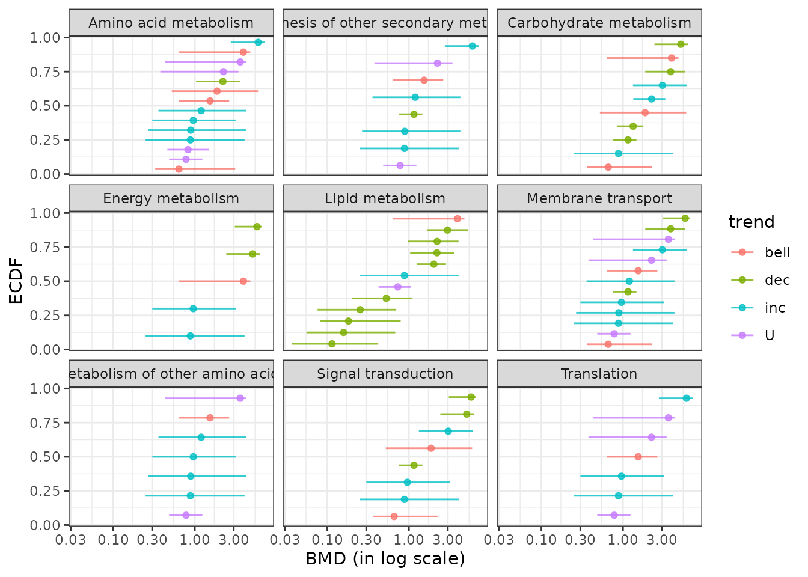

The function ecdfplotwithCI() can also be used as an alternative as
below to provide the same plot differing by the coloring of intervals
only. (See ?ecdfplotwithCI for more options.)

``` r
ecdfplotwithCI(variable = extendedres$BMD.zSD, 
               CI.lower = extendedres$BMD.zSD.lower, 
               CI.upper = extendedres$BMD.zSD.upper, 
               by = extendedres$path_class,
               CI.col = extendedres$trend) + labs(col = "trend")
```

Using the function bmdplotwithgradient() and its argument `facetby`, the
BMD plot with color gradient can be split here by KEGG pathway class.
(See ?bmdplotwithgradient for more options).

``` r
bmdplotwithgradient(extendedres, BMDtype = "zSD",
                    scaling = TRUE, 
                    facetby = "path_class", 
                    shapeby = "trend") 
```

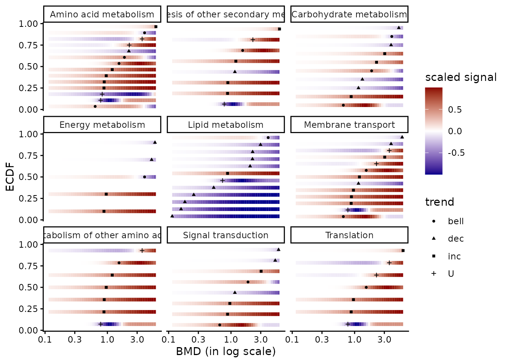

One can **focus on a group of interest**, for instance the group “Lipid
metabolism”, and add the **labels of items** using argument `add.label`
as below to display item identifiers instead of points. In that case in
can be useful to control the limits of the color gradient and the limits
on the x-axis in order to use the same x-scale and signal-scale as in
the global previous plot, as in the following example (see
?bmdplotwithgradient for details).

``` r
extendedres_lipid <- extendedres[extendedres$path_class == "Lipid metabolism",] 

bmdplotwithgradient(extendedres_lipid, BMDtype = "zSD",
                    scaling = TRUE,
                    facetby = "path_class", 
                    add.label = TRUE,
                    xmin = 0, xmax = 6,
                    label.size = 3,
                    line.size = 2) 
```

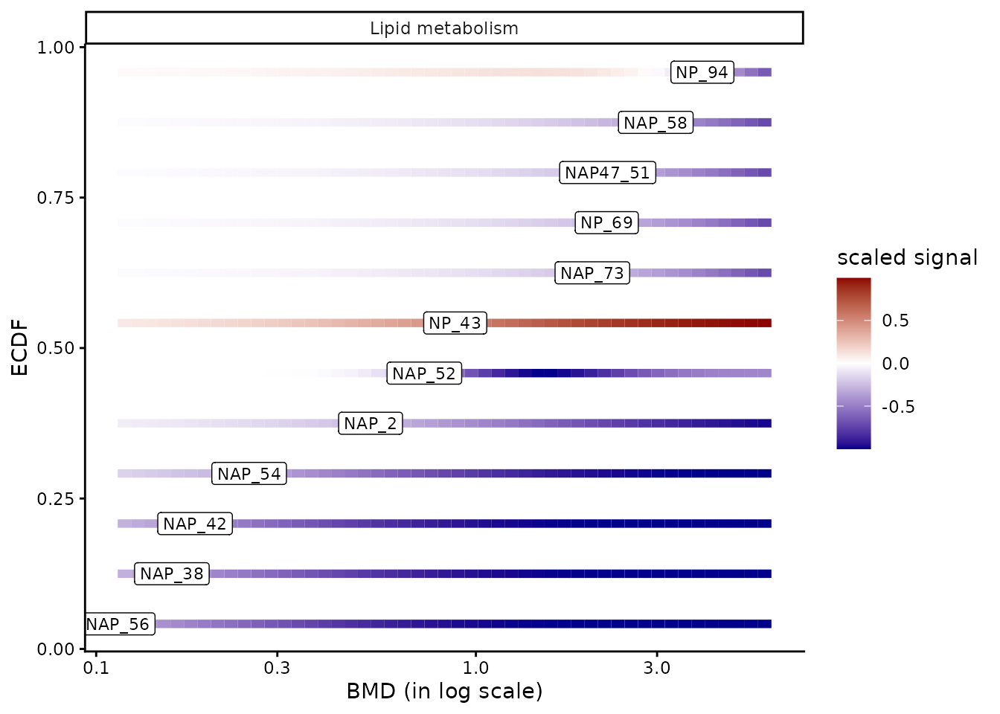

##### Sensitivity plot of biological groups

It is also possible to visualize the sensitivity of **each biological
group** using the sensitivityplot() function, choosing a **BMD summary**
with the argument `BMDsummary` fixed at `"first.quartile"`, `"median"`
or `"median.and.IQR"` (for medians with the interquartile range as an
interval). Moreover, this function will provide **information on the
number of items** involved in each pathway/category (coding for the size
of the points). (See ?sensitivityplot for more options).

As an example, below is an ECDF plot of 25th quantiles of BMD-zSD
calculated here by pathway class.

``` r
sensitivityplot(extendedres, BMDtype = "zSD",
                group = "path_class",
                BMDsummary = "first.quartile") + theme_bw()
```

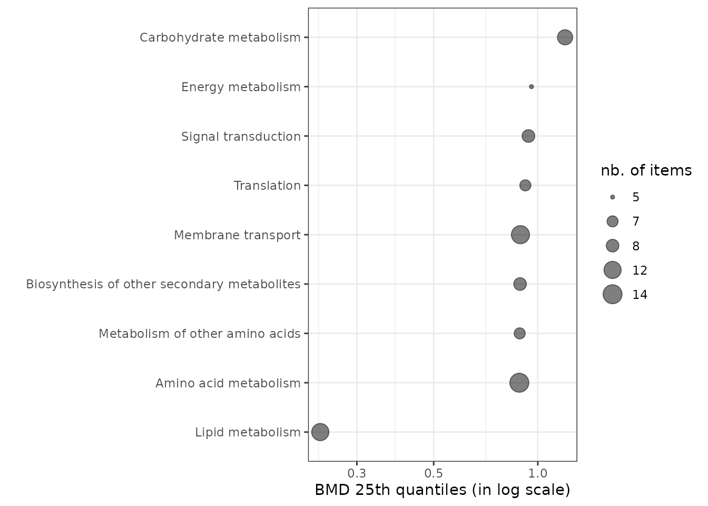

It is possible to use medians of BMD values represent and order the
groups in a sensitivity plot and optionally to add the interquartile
range as a line on the plot, as below:

``` r
sensitivityplot(extendedres, BMDtype = "zSD",
                group = "path_class",
                BMDsummary = "median.and.IQR") + theme_bw()
```

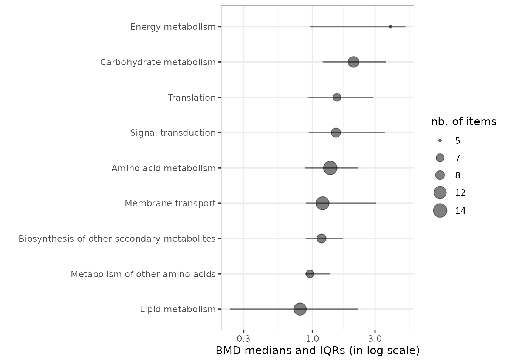

You can customize the sensitivity plot and position the pathway class
labels next to the point instead of on the y-axis, using ggplot2
functions.

``` r
psens <- sensitivityplot(extendedres, BMDtype = "zSD",
                         group = "path_class",
                         BMDsummary = "first.quartile")

psens + 
  theme_bw() +
  theme(axis.text.y = element_blank(), axis.ticks.y = element_blank()) +
  geom_text(aes(label = paste("   ", psens$data$groupby, "   ")), 
            size = 3, hjust = "inward")
```

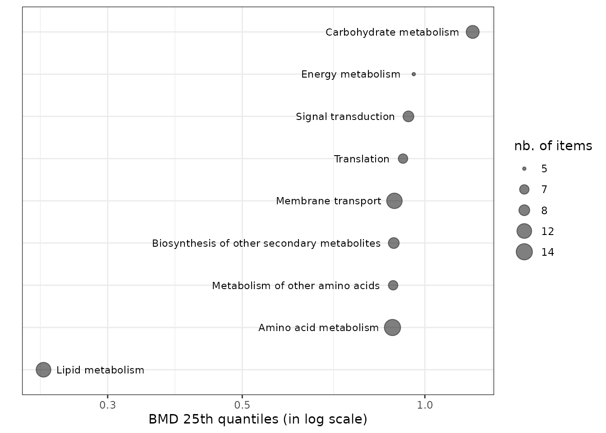

##### Trend plot per biological group

It is possible to represent the **repartition of trends in each
biological group** using the trendplot() function (see ?trendplot for
details).

``` r
trendplot(extendedres, group = "path_class") + theme_bw()
```

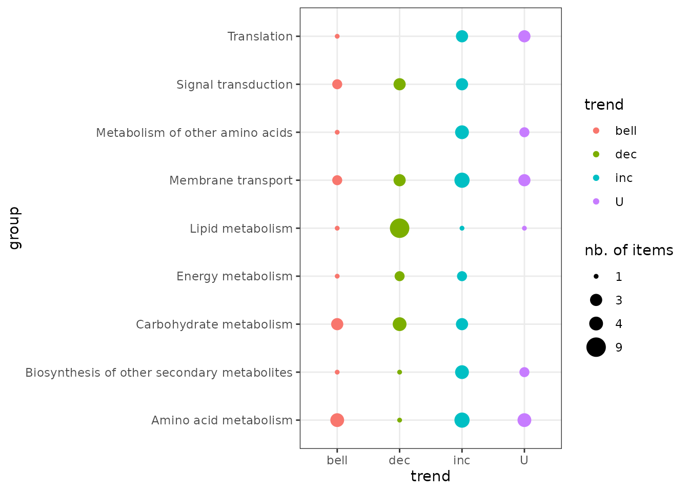

##### Plot of dose-response curves per biological group

The function curvesplot() can show the dose-response curves obtained for
different groups (or one chosen group). As for the use of
bmdplotwithgradient(), the **scaling of those curves can be used is by
default used to focus on the shape of them, and not on the amplitude of
the signal change**. To use this function you have to define the dose
range on which you want the computation of the dose-response fitted
curves, and **we strongly recommend you to choose a range corresponding
to the range of tested/observed doses** in your dataset. Below is a code
to plot the dose-response curves split by biological group (argument
facetby) and colored by trend (argument colorby). As below it is also
possible to add a point at BMD-BMR values on each curve (See ?curvesplot
for more options).

``` r
# Plot of all the scaled dose-reponse curves split by path class
curvesplot(extendedres, facetby = "path_class", scaling = TRUE, npoints = 100, 
           colorby = "trend", xmax = 6.5) + theme_bw()
```

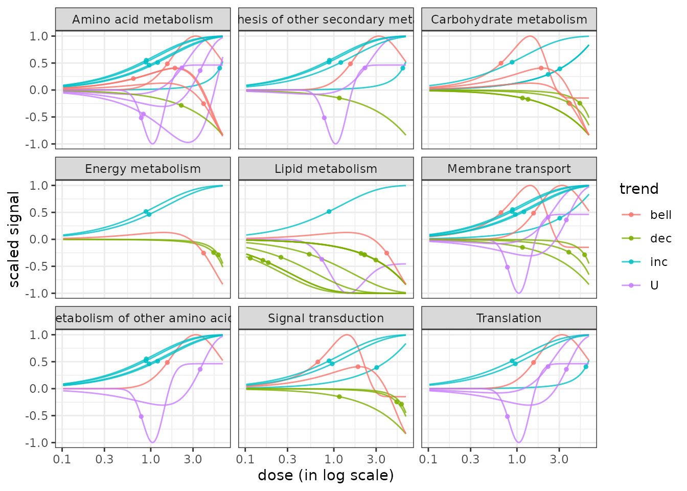

It is also possible using this function to visualize the modeled
response of each item of one biological group, as below:

``` r
# Plot of the unscaled dose-reponses for one chosen group, split by metabolite
LMres <- extendedres[extendedres$path_class == "Lipid metabolism", ]
curvesplot(LMres, facetby = "id", npoints = 100, 
           point.size = 1.5, line.size = 1,
           colorby = "trend", scaling = FALSE,
           xmax = 6.5) + theme_bw() 
```

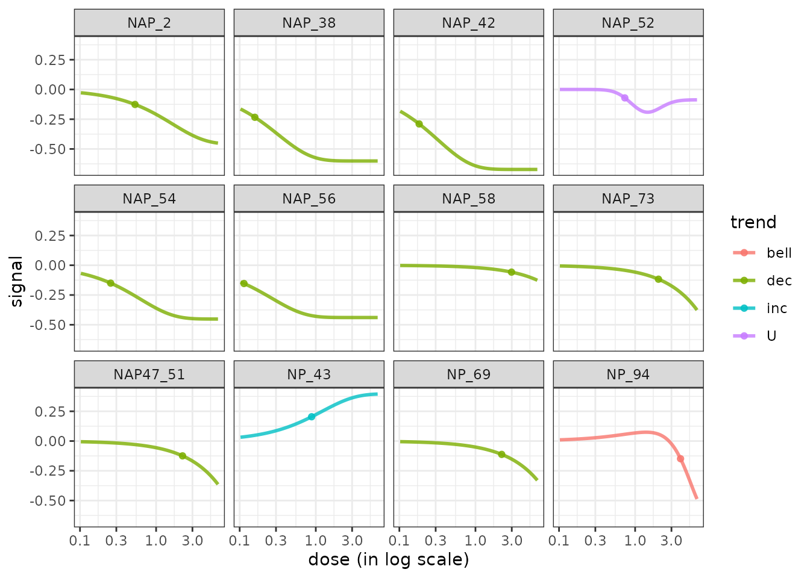

### Comparison of DRomics results obtained at different experimental levels, for example in a multi-omics approach

This section illustrates how to use DRomics functions to help the
interpretation of outputs from different data sets obtained at
**different experimental levels (different molecular levels, different
time points, different experimental settings, …)**. The idea is

- to perform the augmentation of the DRomics output data frame obtained
  at each experimental level ([as previously described for one
  level](#augmentation)),
- to bind the augmented data frames and add a column coding for the
  experimental level and
- to use this column to organize the visualisation of the DRomics output
  and so make possible the **comparison of the responses between
  experimental levels**.

Below is used **an example corresponding to a multi-omics approach**,
the experimental level corresponding to the molecular level, with a
transcriptomic (microarray) and a metabolomic data set issued from the
same experiment. This example uses metabolomics and transcriptomics data
for *Scenedesmus* and triclosan published by [Larras et al. in
2020](https://doi.org/10.1016/j.jhazmat.2020.122727). It is possible to
perform it without R coding within the **shiny application
DRomicsInterpreter-shiny**. Report to the [introduction
section](#introduction) to see how to launch the shiny application.

#### Augmentation of the data frames of DRomics results with biological annotation

Following the same steps as described before [for one
level](#augmentation), below is an example of R code to **import the
DRomics results for microarray data**, and to **merge them with the data
frame giving on biological annotation of selected items**.

``` r
# 1. Import the data frame with DRomics results to be used
contigresfilename <- system.file("extdata", "triclosanSVcontigres.txt", package = "DRomics")
contigres <- read.table(contigresfilename, header = TRUE, stringsAsFactors = TRUE)

# 2. Import the data frame with biological annotation (or any other descriptor/category 
# you want to use, here KEGG pathway classes) 
contigannotfilename <- system.file("extdata", "triclosanSVcontigannot.txt", package = "DRomics")
# contigannotfilename <- "yourchosenname.txt" # for a local file
contigannot <- read.table(contigannotfilename, header = TRUE, stringsAsFactors = TRUE)

# 3. Merging of both previous data frames   
contigextendedres <- merge(x = contigres, y = contigannot, by.x = "id", by.y = "contig")
# to see the first lines of the data frame
head(contigextendedres)
```

    ##       id  irow adjpvalue       model nbpar        b  c    d     e  f SDres
    ## 1 c00134  2802  2.76e-04      linear     2 -0.21794 NA 10.9    NA NA 0.417
    ## 2 c00276 39331  9.40e-07 exponential     3  1.49944 NA 12.4 -2.20 NA 0.287
    ## 3 c00281 41217  2.89e-06 exponential     3  1.40817 NA 12.4 -2.41 NA 0.281
    ## 4 c00322 52577  1.88e-03 exponential     3  0.00181 NA 16.4  1.15 NA 0.145
    ## 5 c00323 52590  1.83e-03 exponential     3  1.48605 NA 15.3 -2.31 NA 0.523
    ## 6 c00380 53968  4.16e-04 exponential     3  1.31958 NA 14.5 -2.52 NA 0.395
    ##       typology trend   y0 yrange maxychange xextrem yextrem BMD.zSD BMR.zSD
    ## 1        L.dec   dec 10.9  1.445      1.445      NA      NA   1.913    10.4
    ## 2 E.dec.convex   dec 12.4  1.426      1.426      NA      NA   0.467    12.1
    ## 3 E.dec.convex   dec 12.4  1.319      1.319      NA      NA   0.536    12.1
    ## 4 E.inc.convex   inc 16.4  0.567      0.567      NA      NA   5.073    16.6
    ## 5 E.dec.convex   dec 15.3  1.402      1.402      NA      NA   1.004    14.8
    ## 6 E.dec.convex   dec 14.5  1.225      1.225      NA      NA   0.896    14.1
    ##   BMD.xfold BMR.xfold BMD.zSD.lower BMD.zSD.upper BMD.xfold.lower
    ## 1      4.98      9.77         1.255         2.759            3.94
    ## 2      3.88     11.19         0.243         0.825            2.32
    ## 3      5.13     11.17         0.282         0.925            2.79
    ## 4        NA     18.05         2.650         5.573             Inf
    ## 5        NA     13.80         0.388         2.355            3.06
    ## 6        NA     13.08         0.366         2.090            4.58
    ##   BMD.xfold.upper nboot.successful                           path_class
    ## 1             Inf              500                    Energy metabolism
    ## 2             Inf              497                Nucleotide metabolism
    ## 3             Inf              495                Nucleotide metabolism
    ## 4             Inf              332                          Translation
    ## 5             Inf              466 Metabolism of cofactors and vitamins
    ## 6             Inf              469     Folding, sorting and degradation

The [previouly created](#augmentation) metabolomics data frame (extended
results with biological annotation) is renamed for the sake of
homogeneity.

``` r
metabextendedres <- extendedres
```

#### Binding of the data frames corresponding the results at each experimental level

The next step is the **bind of the augmented data frames** of results
obtained at the different levels (here transcriptomics and metabolomics
data frames) and the **add of a variable** (here named level) **coding
for the level** (here a factor with two levels, metabolites and
contigs).

``` r
extendedres <- rbind(metabextendedres, contigextendedres)
extendedres$explevel <- factor(c(rep("metabolites", nrow(metabextendedres)),
                              rep("contigs", nrow(contigextendedres))))
# to see the first lines of the data frame
head(extendedres)
```

    ##       id irow adjpvalue       model nbpar       b  c    d     e  f  SDres
    ## 1  NAP_2    2  6.23e-05 exponential     3  0.4598 NA 5.94 -1.65 NA 0.1260
    ## 2 NAP_23   21  1.11e-05      linear     2 -0.0595 NA 5.39    NA NA 0.0793
    ## 3 NAP_30   28  1.03e-05      linear     2 -0.0451 NA 7.86    NA NA 0.0520
    ## 4 NAP_30   28  1.03e-05      linear     2 -0.0451 NA 7.86    NA NA 0.0520
    ## 5 NAP_30   28  1.03e-05      linear     2 -0.0451 NA 7.86    NA NA 0.0520
    ## 6 NAP_30   28  1.03e-05      linear     2 -0.0451 NA 7.86    NA NA 0.0520
    ##       typology trend   y0 yrange maxychange xextrem yextrem BMD.zSD BMR.zSD
    ## 1 E.dec.convex   dec 5.94  0.456      0.456      NA      NA   0.528    5.82
    ## 2        L.dec   dec 5.39  0.461      0.461      NA      NA   1.333    5.31
    ## 3        L.dec   dec 7.86  0.350      0.350      NA      NA   1.154    7.81
    ## 4        L.dec   dec 7.86  0.350      0.350      NA      NA   1.154    7.81
    ## 5        L.dec   dec 7.86  0.350      0.350      NA      NA   1.154    7.81
    ## 6        L.dec   dec 7.86  0.350      0.350      NA      NA   1.154    7.81
    ##   BMD.xfold BMR.xfold BMD.zSD.lower BMD.zSD.upper BMD.xfold.lower
    ## 1        NA      5.35         0.200          1.11             Inf
    ## 2        NA      4.85         0.853          1.75            7.61
    ## 3        NA      7.07         0.752          1.46             Inf
    ## 4        NA      7.07         0.752          1.46             Inf
    ## 5        NA      7.07         0.752          1.46             Inf
    ## 6        NA      7.07         0.752          1.46             Inf
    ##   BMD.xfold.upper nboot.successful                                  path_class
    ## 1             Inf              957                            Lipid metabolism
    ## 2             Inf             1000                     Carbohydrate metabolism
    ## 3             Inf             1000                     Carbohydrate metabolism
    ## 4             Inf             1000 Biosynthesis of other secondary metabolites
    ## 5             Inf             1000                          Membrane transport
    ## 6             Inf             1000                         Signal transduction
    ##      explevel
    ## 1 metabolites
    ## 2 metabolites
    ## 3 metabolites
    ## 4 metabolites
    ## 5 metabolites
    ## 6 metabolites

#### Comparison of results obtained at the different experimental levels using basic R functions

Below are examples of illustrations that can be made using basic R
functions to globally compare the results obtained at the different
experimental levels, for example to compute and plot frequencies of
pathways by molecular levels as below.

``` r
(t.pathways <- table(extendedres$path_class, extendedres$explevel)) 
```

    ##                                              
    ##                                               contigs metabolites
    ##   Amino acid metabolism                            54          14
    ##   Biosynthesis of other secondary metabolites       0           8
    ##   Carbohydrate metabolism                          76          10
    ##   Energy metabolism                                49           5
    ##   Lipid metabolism                                 46          12
    ##   Membrane transport                               13          13
    ##   Metabolism of other amino acids                  26           7
    ##   Signal transduction                              13           8
    ##   Translation                                      68           7
    ##   Folding, sorting and degradation                 35           0
    ##   Glycan biosynthesis and metabolism               14           0
    ##   Metabolism of cofactors and vitamins             57           0
    ##   Metabolism of terpenoids and polyketides         15           0
    ##   Nucleotide metabolism                            30           0
    ##   Replication and repair                            9           0
    ##   Transcription                                    23           0
    ##   Transport and catabolism                         14           0
    ##   Xenobiotics biodegradation and metabolism        20           0

``` r
original.par <- par()
par(las = 2, mar = c(4,13,1,1))
barplot(t(t.pathways), beside = TRUE, horiz = TRUE, 
        cex.names = 0.7, legend.text = TRUE, 
        main = "Frequencies of pathways")
```

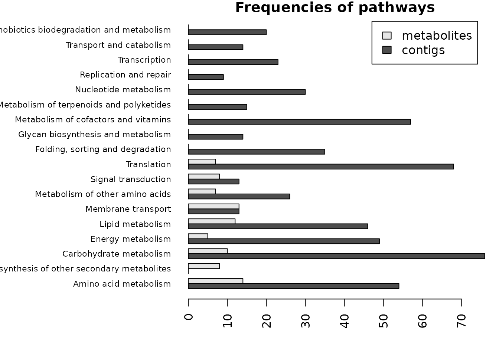

``` r
par(original.par)
```

To do the same plot in proportions, just apply the function prop.table()
to the table of frequencies `t.pathways`.

Here the ggplot2 grammar is used to plot the ECDF of BMD_zSD using
different colors for the different molecular levels, after removing the
redundant lines corresponding to items corresponding to more than one
pathway.

``` r
unique.items <- unique(extendedres$id)
ggplot(extendedres[match(unique.items, extendedres$id), ], aes(x = BMD.zSD, color = explevel)) +
      stat_ecdf(geom = "step") + ylab("ECDF") + theme_bw()
```

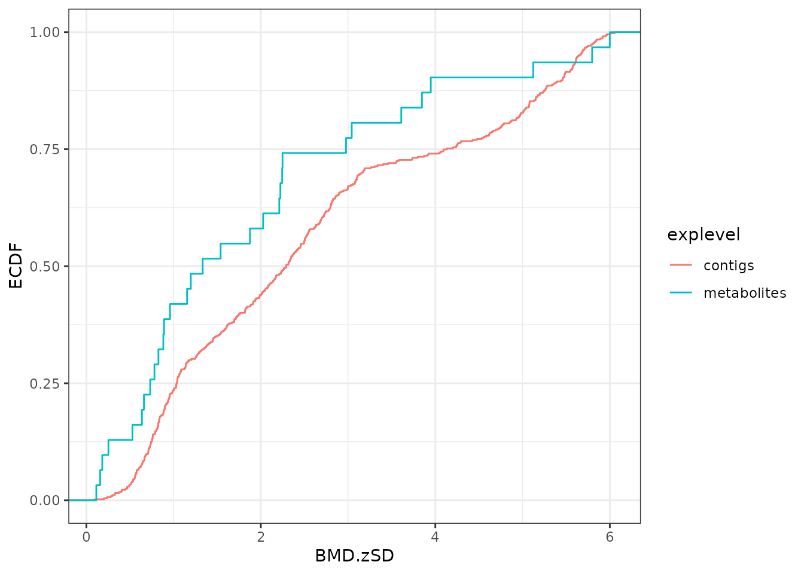

#### Comparison of results obtained at the different experimental levels using DRomics functions

##### ECDF plot of BMD values per group and experimental level using DRomics functions

Using the function bmdplot() the ECDF plot of the BMD-zSD values can be
colored or split by experimental level and/or split by group (here by
KEGG pathway class) as below. (See ?bmdplot for more options, for
example to add confidence intervals, …, as in [the previous section
presenting bmdplot()](#bmdplot)).

``` r
# BMD ECDF plot split by molecular level, after removing items redundancy
bmdplot(extendedres[match(unique.items, extendedres$id), ], BMDtype = "zSD", 
                    facetby = "explevel", point.alpha = 0.4) + theme_bw()
```

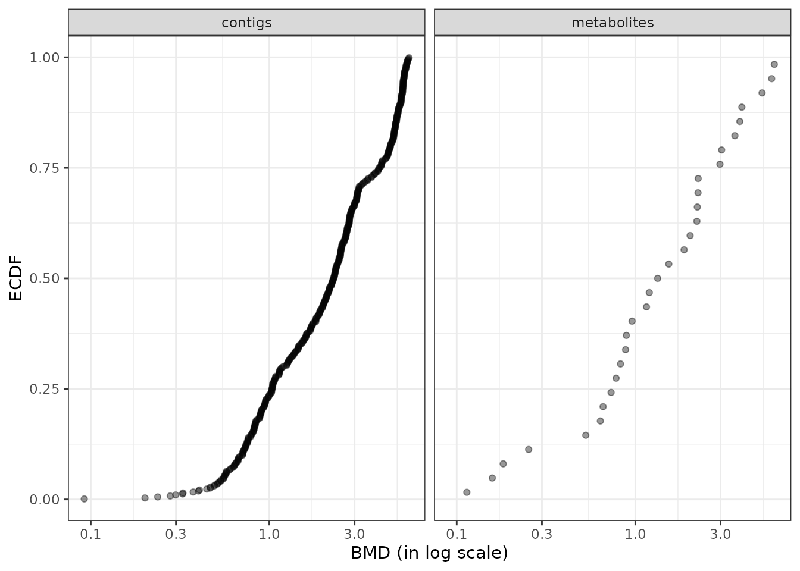

``` r
# BMD ECDF plot colored by molecular level and split by path class
bmdplot(extendedres, BMDtype = "zSD", 
                    facetby = "path_class", 
                    colorby = "explevel",
                    point.alpha = 0.4) + 
              labs(col = "molecular level") + theme_bw()
```

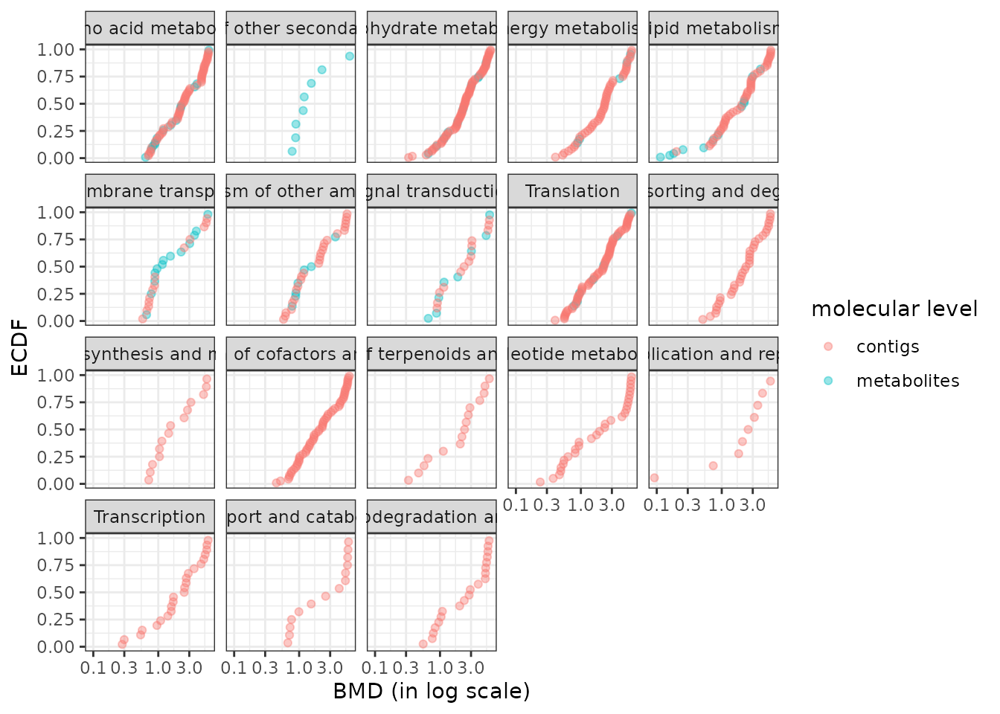

##### Plot of the trend repartition per group and experimental level

Using the function trendplot() and its arguments `facetby` it is
possible to show the repartition of trends of responses in each
biological group for all experimental levels.

``` r
# Preliminary optional alphabetic ordering of path_class groups
extendedres$path_class <- factor(extendedres$path_class, 
                levels = sort(levels(extendedres$path_class), decreasing = TRUE))

# Trend plot
trendplot(extendedres, group = "path_class", facetby = "explevel") +
  theme_bw()
```

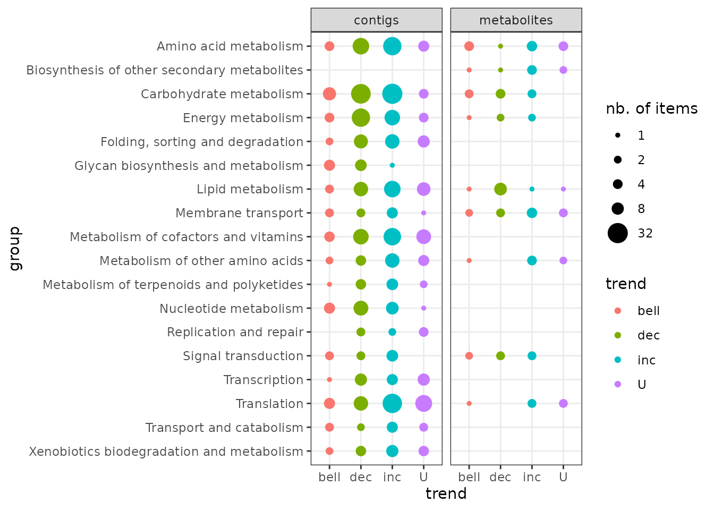

##### Sensitivity plot per group and experimental level

Using the function sensitivityplot() and its arguments `group` and
`colorby`, it is possible to show a summary of BMD values with size of
points coding for the number of items in each group as in the example,
where the 25th quartiles of BMD values are represented per KEGG pathway
class for each molecular level. (See ?sensitivityplot for more options).

``` r
sensitivityplot(extendedres, BMDtype = "zSD",
                group = "path_class", colorby = "explevel",
                BMDsummary = "first.quartile") + theme_bw()
```

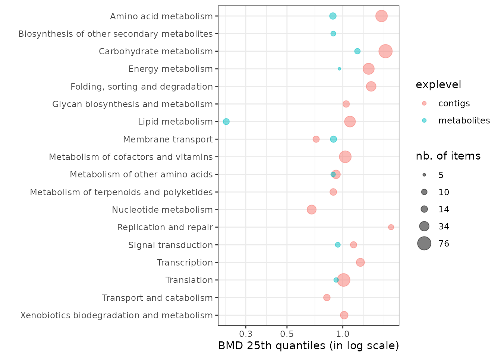

##### Selection of groups on which to focus using the selectgroups() function

When the number of biological groups obtained after annotation of items
is too high, it may be useful to **select groups on which to focus**, to
**enhance the visibility of plots**. This can be done for example using
results of enrichment procedures in the case where enrichment is
possible (e.g. for sequenced organisms). One could also use selection
criteria based **on the number of items in each biological group**
(argument `nitems`, to select the **most represented groups**,
represented by more than `nitems`) and/or **on the BMD summary value**
(argument `BMDmax`, to select the **most sensitive groups**, so those
below `BMDmax`). The selectgroups() function can be used for this
purpose as in the example below (see ?selectgroups for details).  
When using this function you may optionally choose to keep the results
of all the experimental levels (for comparison purpose) as soon as the
criteria are met for the group for at least one experimental level (as
in the example below fixing the argument `keepallexplev` at `TRUE`).

``` r
selectedres <- selectgroups(extendedres, 
                         group = "path_class",
                         explev = "explevel",
                         BMDmax = 0.75,
                         BMDtype = "zSD", 
                         BMDsummary = "first.quartile",
                         nitems = 3,
                         keepallexplev = TRUE)

# BMDplot on this selection
bmdplot(selectedres, BMDtype = "zSD", add.CI = TRUE,
                    facetby = "path_class", facetby2 = "explevel",
                    colorby = "trend") + theme_bw()
```

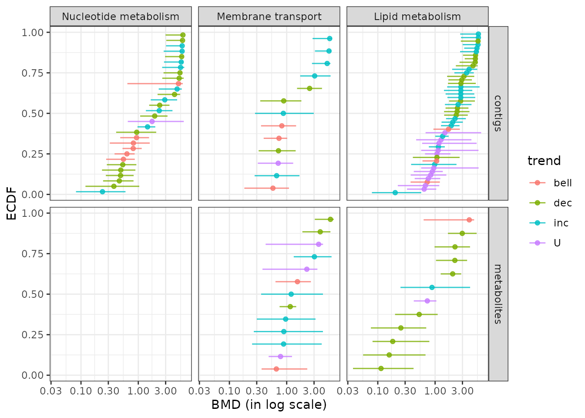

##### BMD ECDF plot with color gradient split by group and experimental level

Using the function bmdplotwithgradient() and its arguments `facetby` and
`facetby2`, the BMD plot with color gradient can be split here by group
and experimental level, as on the example below on a manual selection of
pathway classes present at both molecular levels.(See
?bmdplotwithgradient for more options).

``` r
# Manual selection of groups on which to focus
chosen_path_class <- c("Nucleotide metabolism", 
                       "Membrane transport", 
                       "Lipid metabolism", 
                       "Energy metabolism")
selectedres2 <- extendedres[extendedres$path_class %in% chosen_path_class, ]
bmdplotwithgradient(selectedres2, BMDtype = "zSD", scaling = TRUE,
               facetby = "path_class", facetby2 = "explevel")
```

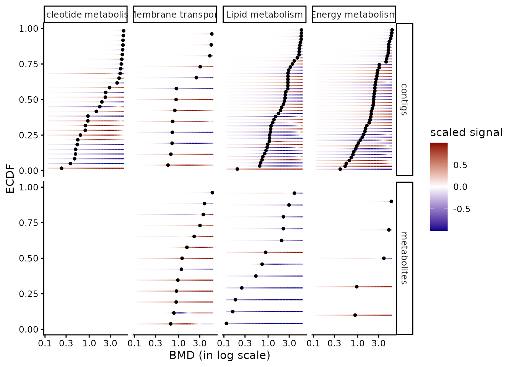

Especially as **metabolomic data and transcriptomic data were not
imported in DRomics in the same scale** (in log2 for transcriptomics and
log10 for metabolomics), the **use of the scaling option of each
dose-response curve is interesting here**. This option focuses on the
shape of responses, skipping the amplitude of changes to the control.

##### Plot of the dose-response curves for a selection of groups

Using the function curvesplot(), specific dose-response curves can be
explored. In the following example, only results related to the “lipid
metabolism” pathway class are explored, using the argument `facetby` to
split by experimental level. In the second example, the plot is split by
biological group using the argument `facetby` and by experimental level
using the argument `facetby2` . (See ?curvesplot for more options).

``` r
# Plot of the unscaled dose-response curves for the "lipid metabolism" path class
# using transparency to get an idea of density of curves with the shame shape
LMres <- extendedres[extendedres$path_class == "Lipid metabolism", ]
curvesplot(LMres, facetby = "explevel", free.y.scales = TRUE, npoints = 100, 
           line.alpha = 0.4, line.size = 1, colorby = "trend",
           xmax = 6.5) + labs(col = "DR trend") + theme_bw()
```

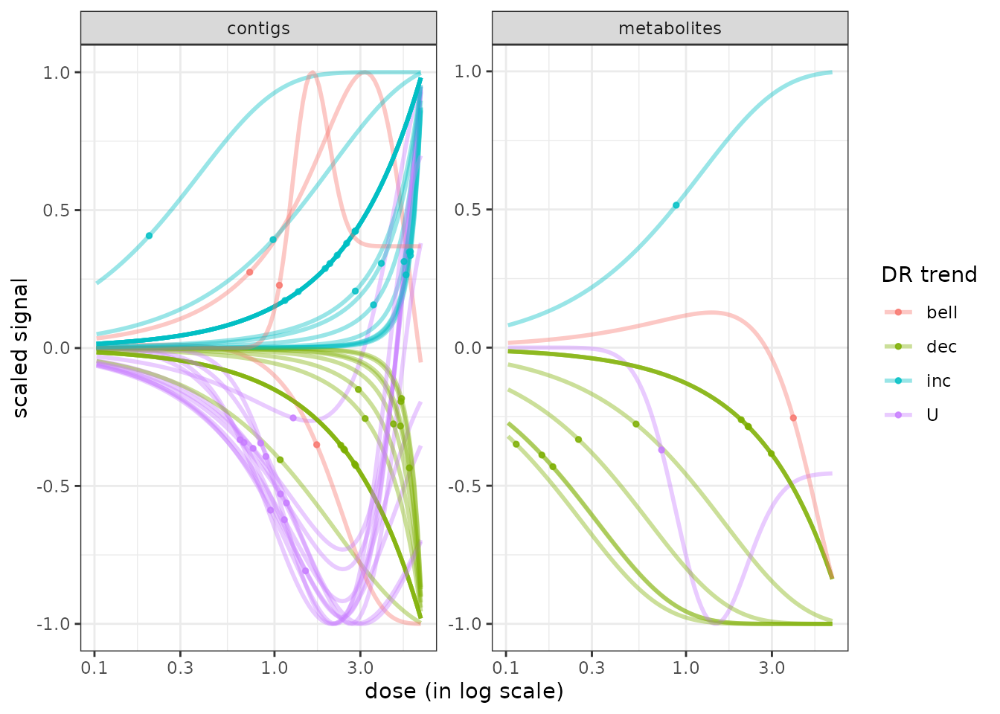

``` r
# Plot of the scaled dose-response curves for previously chosen path classes
curvesplot(selectedres2, scaling = TRUE,
           facetby = "path_class", facetby2 = "explevel",
           npoints = 100, line.size = 1, line.alpha = 0.4,
           colorby = "trend", xmax = 6.5) + labs(col = "DR trend") + theme_bw()
```

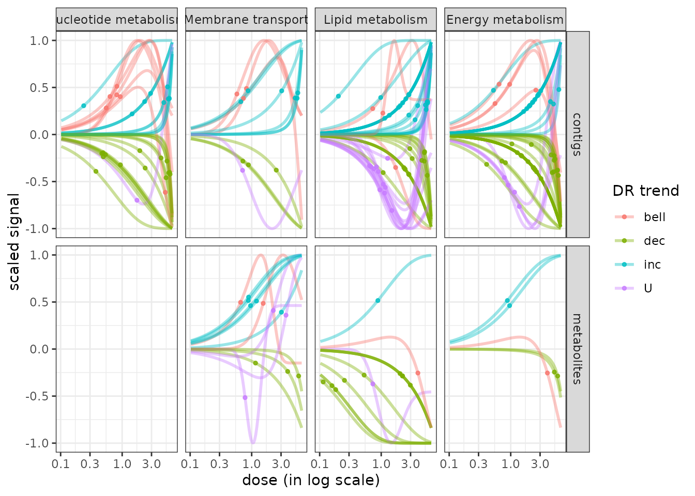

The scaling of the curves only used here in the second plot can be
interesting to focus on the shapes of those curves, skipping the
amplitude of the changes from the control. This helps to evaluate the
homogeneity of the shapes of the responses within each group. It may for
example interesting to observe in this example, that some
transcriptomics responses (contigs) are gathering the same shape (when
we use the scaling option - it is done by default) just differing by
their sign (increasing / decreasing, or U-shape/bell-shape), which does
not clearly appear when dose-response curves are not scaled (as in the
first plot).

## References

- Burnham, KP, Anderson DR (2004). Multimodel inference: understanding
  AIC and BIC in model selection. Sociological methods & research,
  33(2), 261-304.

- Delignette-Muller ML, Siberchicot A, Larras F, Billoir E (2023).
  DRomics, a workflow to exploit dose-response omics data in
  ecotoxicology. Peer Community Journal. doi : 10.24072/pcjournal.325.
  <https://peercommunityjournal.org/articles/10.24072/pcjournal.325/>

- EFSA Scientific Committee, Hardy A, Benford D, Halldorsson T, Jeger
  MJ, Knutsen KH, … & Schlatter JR (2017). Update: use of the benchmark
  dose approach in risk assessment. EFSA Journal, 15(1),
  e04658.<https://efsa.onlinelibrary.wiley.com/doi/full/10.2903/j.efsa.2017.4658>

- Hurvich, CM, Tsai, CL (1989). Regression and time series model
  selection in small samples. Biometrika, 76(2),
  297-307.<https://www.stat.berkeley.edu/~binyu/summer08/Hurvich.AICc.pdf>

- Larras F, Billoir E, Baillard V, Siberchicot A, Scholz S, Wubet T,
  Tarkka M, Schmitt-Jansen M and Delignette-Muller ML (2018). DRomics :
  a turnkey tool to support the use of the dose-response framework for
  omics data in ecological risk assessment. Environmental Science &
  Technology. <https://pubs.acs.org/doi/10.1021/acs.est.8b04752>. You
  can also find this article at : <https://hal.science/hal-02309919>

- Larras F, Billoir E, Scholz S, Tarkka M, Wubet T, Delignette-Muller
  ML, Schmitt-Jansen M (2020). A multi-omics concentration-response
  framework uncovers novel understanding of triclosan effects in the
  chlorophyte Scenedesmus vacuolatus. Journal of Hazardous Materials.
  <https://doi.org/10.1016/j.jhazmat.2020.122727>.
