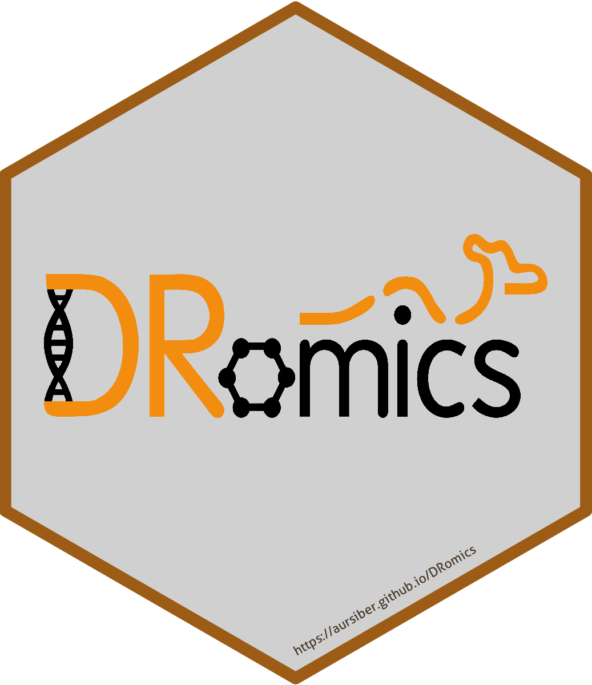

# DRomics: Dose Response for Omics 

[](http://cran.r-project.org/package=DRomics)
[](https://cran.r-project.org/package=DRomics)
[](https://github.com/lbbe-software/DRomics/actions)
[](https://www.gnu.org/licenses/gpl-3.0)
[](https://www.repostatus.org/#active)
[](https://archive.softwareheritage.org/browse/origin/?origin_url=https://github.com/lbbe-software/DRomics)

`DRomics` is a freely available tool for dose-response (or
concentration-response) characterization from omics data. It is
especially dedicated to omics data obtained using a typical
dose-response design, favoring a great number of tested doses (or
concentrations) rather than a great number of replicates (no need of
replicates to use `DRomics`).

After a first step which consists in importing, checking and if needed
normalizing/transforming the data (step 1), the aim of the proposed
workflow is to select monotonic and/or biphasic significantly responsive
items (e.g. probes, contigs, metabolites) (step 2), to choose the
best-fit model among a predefined family of monotonic and biphasic
models to describe the response of each selected item (step 3), and to
derive a benchmark dose or concentration from each fitted curve (step
4). Those steps can be performed in R using `DRomics` functions, or
using the shiny application named `DRomics-shiny`.

In the available version, `DRomics` supports single-channel microarray
data (in log2 scale), RNAseq data (in raw counts) and other continuous
omics data such as metabolomics or proteomics (in log scale). In order
to link responses across biological levels based on a common method,
`DRomics` also handles continuous apical data as long as they meet the
use conditions of least squares regression (homoscedastic Gaussian
regression).

As built in the environmental risk assessment context where omics data
are more often collected on non-sequenced species or species
communities, `DRomics` does not provide an annotation pipeline. The
annotation of items selected by `DRomics` may be complex in this
context, and must be done outside `DRomics` using databases such as KEGG
or Gene Ontology. `DRomics` functions can then be used to help the
interpretation of the workflow results in view of the biological
annotation. It enables a multi-omics approach, with the comparison of
the responses at the different levels of organization (in view of a
common biological annotation). It can also be used to compare the
responses at one organization level, but measured under different
experimental conditions (e.g. different time points). This
interpretation can be performed in R using `DRomics` functions, or using
a second shiny application `DRomicsInterpreter-shiny`.

All informations about DRomics can also be found at
[https://lbbe.univ-lyon1.fr/fr/dromics](https://lbbe.univ-lyon1.fr/fr/dromics).

**Keywords** : dose response modelling / benchmark dose (BMD) /
environmental risk assessment / transcriptomics / proteomics /
metabolomics / toxicogenomics / multi-omics

## The package

The `limma` and `DESeq2` packages from Bioconductor must be installed
for the use of `DRomics` (can take a long time):

``` r
if (!requireNamespace("BiocManager", quietly = TRUE)) {
   install.packages("BiocManager")
} else {
  BiocManager::install(ask = FALSE, update = TRUE)
}

BiocManager::install(c("limma", "DESeq2"))
```

The stable version of `DRomics` can be installed from CRAN using:

``` r
install.packages("DRomics")
```

The development version of `DRomics` can be installed from GitHub
(`remotes` needed):

``` r
if (!requireNamespace("remotes", quietly = TRUE))
   install.packages("remotes")
   
remotes::install_github("lbbe-software/DRomics")
```

Finally load the package in your current R session with the following R
command:

``` r
require("DRomics")
```

## Vignette and cheat sheet

A **vignette** is attached to the `DRomics` package. This vignette is
intended to help users to start using the `DRomics` package. It is
complementary to the reference manual where you can find more details on
each function of the package. The first part of this vignette (Main
workflow, steps 1 to 4) could also help users of the first shiny
application `DRomics-shiny`. The second part (Help for biological
interpretation of `DRomics` outputs) could also help users of the second
shiny application `DRomicsInterpreter-shiny`.

This vignette can be reached by:

``` r
vignette("DRomics_vignette")
```

Note that, by default, the vignette is not installed when the package is
installed through GitHub. The following command (rather long to execute
because of the large size of the vignette) will allow you to access the
vignette of the development version of the package you installed from
GitHub:

``` r
remotes::install_github("lbbe-software/DRomics", build_vignettes = TRUE)
```

A **cheat sheet** that sum up the DRomics workflow is also available.
[](https://github.com/rstudio/cheatsheets/blob/master/DRomics.pdf)

## Two shiny apps

The two shiny apps (`DRomics-shiny` and `DRomicsInterpreter-shiny`) that
work with DRomics are available :

- on the LBBE shiny server at
  - <https://lbbe-shiny.univ-lyon1.fr/DRomics/inst/DRomics-shiny/>
  - <https://lbbe-shiny.univ-lyon1.fr/DRomics/inst/DRomicsInterpreter-shiny/>
- in the Biosphere cloud, if you or your lab is a partner of the IFB
  (Institut Français de Bioinformatique), at
  - <https://biosphere.france-bioinformatique.fr/catalogue/appliance/176/>
    for DRomics-shiny
  - <https://biosphere.france-bioinformatique.fr/catalogue/appliance/209/>
    for DRomicsInterpreter-shiny
- locally in your R session doing:
  - `install.packages(c("shiny", "shinyBS", "shinycssloaders", "shinyjs", "shinyWidgets", "sortable", "plotly"))`
  - `shiny::runApp(system.file("DRomics-shiny", package = "DRomics"))`
  - `shiny::runApp(system.file("DRomicsInterpreter-shiny", package = "DRomics"))`

These shiny apps are runing with the development version of `DRomics`.

These two interactive shiny applications provide an intuitive entry
point to `DRomics` and allow users to explore the core dose–response
analysis workflow implemented in the package. They are designed to help
users become familiar with the main features without requiring advanced
R programming skills. To facilitate extended use and support
reproducible research, the last tab of each application displays the R
code used to perform the analysis, which can be reused and adapted to
the user’s own data.

## Authors & Contacts

If you have any need that is not yet covered, any feedback on the
package / shiny app, or any training needs, feel free to email us at
<dromics@univ-lyon1.fr> .

Issues can be reported on
<https://github.com/lbbe-software/DRomics/issues> .

- Elise Billoir: <elise.billoir@univ-lorraine.fr>
- Marie-Laure Delignette-Muller:
  <marielaure.delignettemuller@vetagro-sup.fr>
- Floriane Larras: <floriane.larras@kreatis.eu>
- Mechthild Schmitt-Jansen: <mechthild.schmitt@ufz.de>
- Aurélie Siberchicot: <aurelie.siberchicot@univ-lyon1.fr>

## Citation

If you use `DRomics`, you should cite:  

Delignette-Muller ML, Siberchicot A, Larras F, Billoir E (2023).
*DRomics, a workflow to exploit dose-response omics data in
ecotoxicology*. Peer Community Journal.
[https://peercommunityjournal.org/articles/10.24072/pcjournal.325/](https://peercommunityjournal.org/articles/10.24072/pcjournal.325/)

Larras F, Billoir E, Baillard V, Siberchicot A, Scholz S, Wubet T,
Tarkka M, Schmitt-Jansen M and Delignette-Muller ML (2018). *DRomics : a
turnkey tool to support the use of the dose-response framework for omics
data in ecological risk assessment*. Environmental Science & Technology.
[https://pubs.acs.org/doi/10.1021/acs.est.8b04752](https://pubs.acs.org/doi/10.1021/acs.est.8b04752)
You can find this article at:
[https://hal.science/hal-02309919](https://hal.science/hal-02309919)

You can also look at the following citation for a complete example of
use:  
Larras F, Billoir E, Scholz S, Tarkka M, Wubet T, Delignette-Muller ML,
Schmitt-Jansen M (2020). *A multi-omics concentration-response framework
uncovers novel understanding of triclosan effects in the chlorophyte
Scenedesmus vacuolatus*. Journal of Hazardous Materials.
[](https://doi.org/10.1016/j.jhazmat.2020.122727.)<https://doi.org/10.1016/j.jhazmat.2020.122727>.
